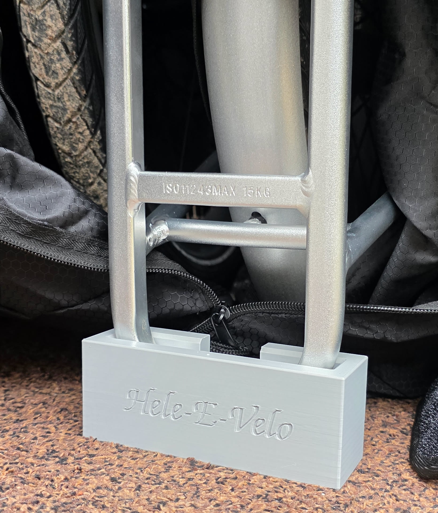
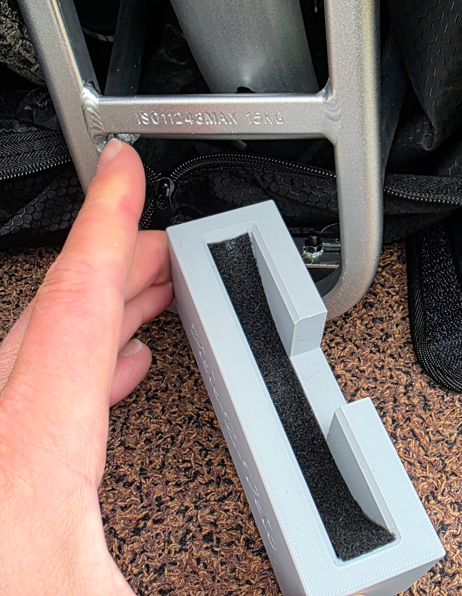

# ADO AIR Carbon Rear Rack Stand

This project provides a fully parametric OpenSCAD model for a custom stand designed for the ADO AIR Carbon folding e-bike's rear rack. When the bike is folded, the rear rack is typically oriented vertically in a 'U' shape, with the tail light bracket extending horizontally from the bottom.

This stand offers enhanced stability and protects the rack from scratches by holding it securely off the ground.

## Features:

The OpenSCAD model (`ADO-AIR-Carbon-Rear-Rack-Stand.scad`) is highly customizable and includes:

*   **Perfect Fit Trench**: A precisely curved trench is cut into the top of the stand to perfectly cup the 'U'-shaped rear rack, allowing it to drop in vertically (along the Z-axis) for a snug, stable fit.
*   **Tail Light Slot**: An open vertical slot in the rear wall accommodates the welded tail light bracket, allowing it to slide down and protrude safely out the back.
*   **Rounded Edges**: All outer edges of the stand, as well as the inner top edges of the rack cutout, are smoothly rounded for a premium look and feel, and to prevent snagging.
*   **Deep Counterbored Mounting Holes**: Dual-purpose drainage/mounting holes with deep countersinks are located in the trench floor. These allow you to optionally secure the stand to a surface (e.g., a floor or wooden board) while completely hiding the screw heads under the rack.
    
*   **Custom Engraved Text**: Personalize your stand with custom text engraved directly into the front face. The model defaults to a beautiful calligraphic font, which can be changed to other installed fonts on your system.
*   **Cutaway View for Verification**: An OpenSCAD `cutaway` render mode is available to inspect the internal fit of the rack within the stand's curved trench.

## Usage & Customization:

1.  **Open in OpenSCAD**: Open the `ADO-AIR-Carbon-Rear-Rack-Stand.scad` file in OpenSCAD.
2.  **Use the Customizer**: Adjust parameters like `rack_width`, `tube_size`, `bend_radius`, `clearance_floor`, `hug_height`, `wall_thickness`, `foot_rounding`, `inner_lip_rounding`, `tail_light_position`, `front_text_string`, `front_text_font`, and `mounting_countersinks_enabled` to perfectly match your rack and preferences.
3.  **Render & Export**: Use `F5` to preview the model, `F6` to render it (for accurate STL export), and `F7` to export it as an STL file for 3D printing.

## 3D Printing Recommendations:

*   **Material**: TPU (95A) for flexibility and grip, or PETG/ABS for rigidity and durability.
*   **Orientation**: Print flat on the base of the stand for best results. No supports are required.

