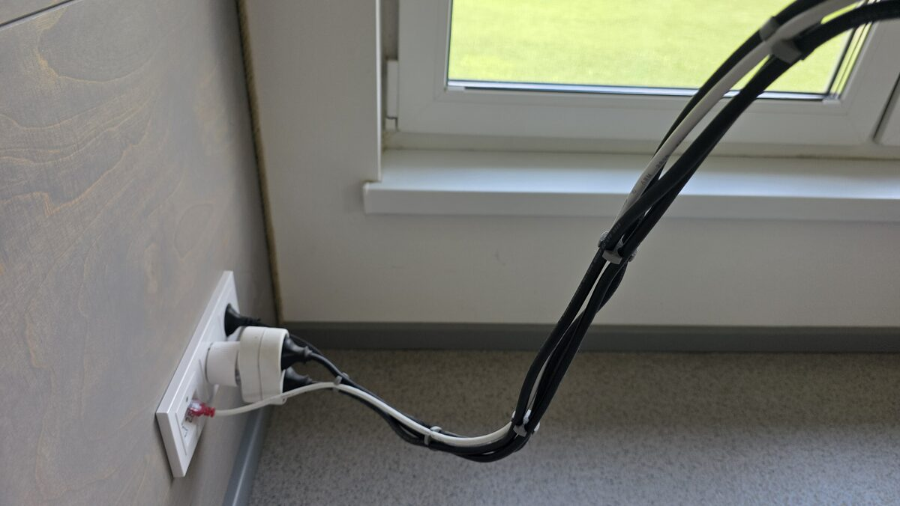

# Symmetrical Parametric Cable Comb / Dresser / Organizer

A highly configurable, circular cable comb designed to organize and dress computer power lines, monitor cords, Ethernet cables, and peripherals. This design is robust, completely solid in the center for maximum strength, and optimized for 3D printing without supports.

## Visuals

### Real-world Model / Photograph

### OpenSCAD 3D CAD Render

---

## Features

- **Symmetrical circular entry slots**: Incorporates trigonometric fillet arcs that merge perfectly tangent to the slot walls, allowing cables to slide in and snap into place effortlessly with zero friction.
- **Solid Core**: No center hole, providing a solid weight and robust structure to keep cables neatly dressed.
- **Hybrid Configuration**: 
  - **Uniform Mode**: Instantly generate combs with $N$ equal-sized slots (e.g., 4, 6, 8, 12) of custom diameters.
  - **Custom List Mode**: Supply an array of varying sizes (e.g., `[7, 7, 7, 5]`) to perfectly fit a specific setup (like 3 HDMI/Power cables and 1 thin mouse/keyboard cable).
- **Smooth Edges**: Fully chamfered top, bottom, and hole boundaries to protect soft cable jackets from wearing down or scratching.
- **Support-Free Print-Optimized Geometry**: Every overhanging chamfer is set at a $45^\circ$ angle, making it 100% printable without supports.

---

## How to Customize

1. Install and open [OpenSCAD](https://openscad.org/).
2. Open `Cable-Comb.scad`.
3. Use the **Customizer** panel on the right side of the screen to edit parameters visually:
   - **`use_custom_list`**: Toggle `true` to use custom diameters, or `false` for uniform slots.
   - **`uniform_cable_count` / `uniform_cable_diameter`**: Quickly set slots for uniform setups.
   - **`custom_cable_diameters`**: Input an array of specific diameters (e.g. `[9.5, 7.5, 6.5, 4.5]`).
   - **`comb_height`**: Adjust thickness of the comb.
   - **`wall_thickness`**: Set minimum spacing between adjacent holes.
   - **`outer_wall_thickness`**: Set distance from holes to the outer edge.
   - **`entry_flare_radius`**: Set the radius of the smooth circular entrance funnel.
4. Go to **Design -> Render (F6)**, then **File -> Export as STL (F7)** to save your customized model.

---

## 3D Printing Guidelines

- **Filament**: **PETG** or **ABS/ASA** are recommended for their flexible snap properties. **PLA** works well but can be brittle under high stress.
- **Perimeters**: Use at least **3 to 4 walls** to ensure the springy outer fingers are strong and durable.
- **Infill**: **15% - 20%** with **Gyroid** or **Grid** pattern.
- **Supports**: **None required!** Print flat on the build plate.

---

## License

This project is open-source and licensed under the [MIT License](LICENSE).
