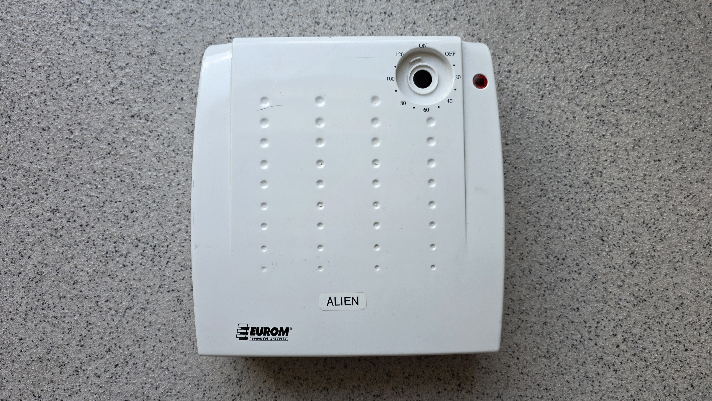
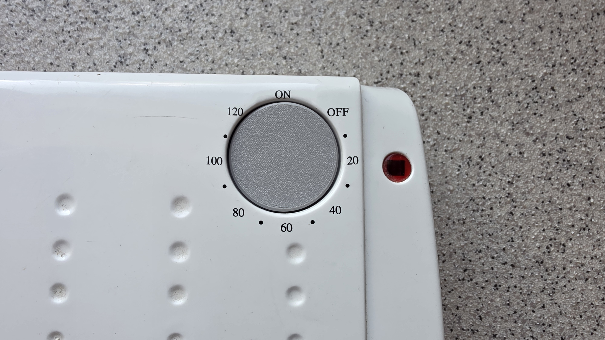
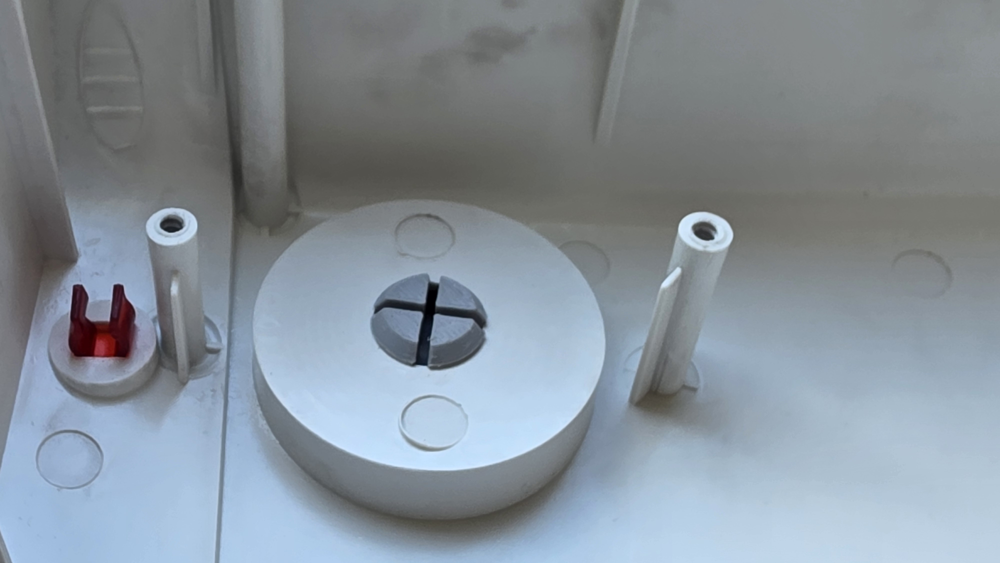

# Parametric Dummy Knob

A parametric OpenSCAD design for a round dummy knob/blockout plug to cleanly fill an empty hole (e.g., where a rotary timer or control knob used to be). 

It features an integrated central post with springy snap-fit catches that latch behind the cabinet wall, holding the knob flush and tight.

---

## Gallery

### Renders and Visualizations

### Dimensions and Cross-Section

---

## Features

- **Fully Parametric**: Customize the outer diameter, height, wall thicknesses, hole size, and box wall thickness easily in OpenSCAD.
- **100% Support-Free Printing**: The underside of the locking shoulder is sloped at a 45-degree angle. This eliminates printing overhangs and allows for support-free fabrication.
- **Print-Bed Ready**: The model automatically rotates $180^\circ$ and translates to lie flat on the build plate for easy STL export.
- **Interactive Fit Preview**: In OpenSCAD preview mode, a semi-transparent box wall with the specified thickness and hole size is displayed to let you verify the fit before rendering.
- **Subtle Styling**: Features a smooth 1mm top chamfer on the knob's edge, plus an optional indicator groove parameter.

---

## Default Dimensions

- **Knob Outer Diameter (`knob_od`)**: `40.0mm`
- **Knob Cap Height (`knob_height`)**: `7.0mm`
- **Knob Wall Thickness (`knob_wall_thickness`)**: `2.0mm`
- **Hole Diameter (`hole_diameter`)**: `14.0mm` (post-clearance sets the post to `13.6mm`)
- **Box Wall Thickness (`wall_thickness`)**: `2.0mm`
- **Snap Catches**: 4 flexible prongs (`num_slots = 2`) with a $45^\circ$ self-supporting locking shoulder.

---

## 3D Printing Instructions

1. **Orientation**: Print the knob upside down (flat top face resting on the print bed). The SCAD file has `print_ready_orientation = true` enabled by default, which does this rotation automatically.
2. **Supports**: **None required.**
3. **Perimeters / Shells**: Set to at least **3 perimeters** (walls). This ensures the flexible post and snap-fit catches are solid and strong rather than filled with sparse infill, maximizing their leaf-spring elasticity.
4. **Materials**: **PETG** or **ABS/ASA** are recommended for their superior flexibility and fatigue life, but standard **PLA** works perfectly fine.

---

## License

This project is licensed under the terms of the **MIT License**.
