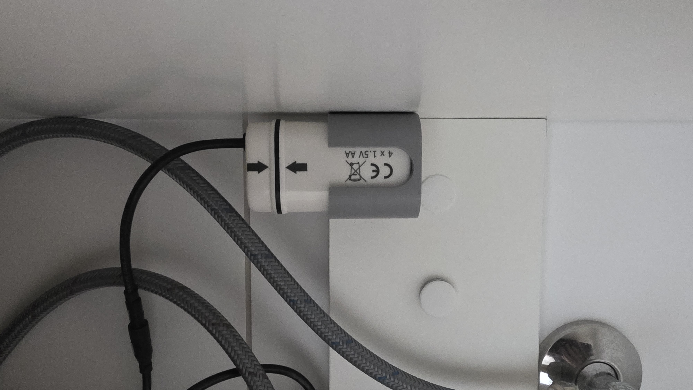

# IKEA BROGRUND Battery Wall Mount Holder

A fully parametric, customizer-ready wall mount holder for the IKEA BROGRUND automatic sensor tap battery box. Optimized for 3D printing without supports and designed with advanced physical and functional details.

---

## Previews

### Isometric 3D Render

### Actual Use Photo

---

## Features

- **Perfect Tapered Fit (Draft Angle)**: Built using the exact measurements of the physical battery box, which is slightly wider at the top (`36.5 x 34.5mm` at `48mm` height) than the bottom (`35.0 x 33.0mm`). The internal pocket cavity is 3D lofted to ensure a perfect snug slide.
- **Top Inner Chamfer**: The top rim flares outward by `1.5mm` to act as a funnel guide, making inserting the battery box incredibly smooth and satisfying.
- **Deeply Recessed Screw Heads**: Standard 3mm wood screw holes are shifted `1.0mm` deeper into the back wall, cutting a clean recess pocket. This ensures the screw heads sit completely below the sliding plane so they cannot scratch the battery box.
- **Intelligent Screwdriver Access Holes**: In the default internal mount configuration, the screwdriver access holes are automatically omitted in the front wall if the vertical slot already exposes the screw positions. If you turn off the front slot, the model automatically draws them back in.
- **Multiple Mounting Options (`mount_type`)**:
  - `internal` *(Default)*: Hidden wall-mount screws inside the pocket with dynamic front screwdriver access.
  - `flanges`: Classic top and bottom mounting tabs with beautiful rounded corners.
  - `side_flanges`: Left and right mounting tabs for wide but shallow surfaces.
- **Bottom Cable Pass-through**: A sturdy bottom support rim includes a generous center opening for cables, finger ejection, and water/dust drainage.

---

## Parameters

All dimensions are customizable in the OpenSCAD Customizer:

| Category | Parameter | Default Value | Description |
|---|---|---|---|
| **Battery Box** | `battery_bottom_width` | `35.0 mm` | Width of the box at the bottom (longer side) |
| | `battery_bottom_depth` | `33.0 mm` | Depth of the box at the bottom (shorter side) |
| | `battery_top_width` | `36.5 mm` | Width of the box at the measured height |
| | `battery_top_depth` | `34.5 mm` | Depth of the box at the measured height |
| | `battery_measured_height` | `48.0 mm` | Vertical height where top size was measured |
| | `battery_corner_radius` | `8.5 mm` | Corner radius of the battery box |
| | `clearance` | `0.5 mm` | Snug fit allowance on all sides |
| **Holder** | `wall_thickness` | `3.0 mm` | Thickness of the outer bracket walls |
| | `holder_height` | `35.0 mm` | Vertical height of the pocket sleeve |
| | `bottom_thickness` | `3.0 mm` | Thickness of the bottom support floor |
| | `bottom_lip_width` | `4.0 mm` | Width of the support rim at the bottom |
| | `inner_chamfer_size` | `1.5 mm` | Top rim insertion flare |
| **Screws** | `screw_spacing` | `20.0 mm` | Exact distance between screw centers (vertically centered) |
| | `screw_shank_dia` | `3.2 mm` | Hole diameter for 3mm screws |
| | `screw_head_dia` | `6.0 mm` | Countersink head diameter |
| | `screw_head_height` | `1.5 mm` | Countersink head height |
| | `screw_recess_depth` | `1.0 mm` | Depth to sink screw head below the wall |
| **Cutouts** | `front_cutout_type` | `"slot"` | Front cutout style (`"none"`, `"slot"`, `"window"`) |
| | `front_cutout_width` | `15.0 mm` | Width of front slot or window |
| | `front_slot_depth` | `32.0 mm` | Vertical slot depth from the top |

---

## 3D Printing Guidelines

- **Material**: PETG, ABS, or ASA are recommended for bathroom environments, but PLA is perfectly fine for dry areas.
- **Orientation**: Print vertically with the flat bottom face touching the print bed (default `.stl` orientation).
- **Supports**: **None required!** All overhangs, horizontal holes, and bridges are optimized for supportless FDM printing.
- **Infill**: `20% - 30%` (Gyroid or Grid).
- **Perimeters**: At least `3 wall lines` to ensure maximum strength around the screw mounts.

---

## Files in the Project

- [`IKEA-BROGRUND-Battery-Holder.scad`](IKEA-BROGRUND-Battery-Holder.scad): The fully parametric OpenSCAD source code.
- [`IKEA-BROGRUND-Battery-Holder.stl`](IKEA-BROGRUND-Battery-Holder.stl): Precompiled default model, ready to slice and print immediately.
- [`IKEA-BROGRUND-Battery-Holder.png`](IKEA-BROGRUND-Battery-Holder.png): Isometric preview render.
- [`IKEA-BROGRUND-Battery-Holder.jpg`](IKEA-BROGRUND-Battery-Holder.jpg): Photo showing the project in actual use.

---

*Designed and engineered to be perfectly functional, clean, and robust.*
