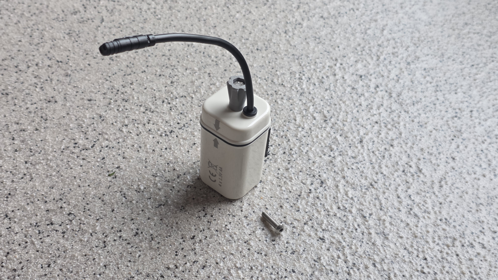

# IKEA BROGRUND Battery Knob

A parametric thumb-knob replacement for the IKEA BROGRUND battery box lid. It replaces the awkward internal hex socket bolt with an easy-to-turn knob, utilizing a standard M4 hex head bolt (e.g., M4x30, with 16mm protruding).

## Overview

This project provides a robust, support-free OpenSCAD design to make opening and closing the battery box lid on the IKEA BROGRUND series effortless. Rather than relying on a hex key / Allen wrench every time you need to change batteries, this ergonomic knob integrates a standard M4 bolt.

## Visuals

### 3D Render

### Completed Assembly

## Pro-Tip: Clean "No-Cap" Assembly

By tuning the parameters `hex_clearance` and `shaft_clearance` in `IKEA-BROGRUND-Battery-Knob.scad` for a very tight fit, you can press-fit the M4 bolt head directly into the hexagonal socket using horizontal jaw pliers (such as **Knipex** pliers). 

This method seats the bolt head so snugly and securely into the knob that **no printable cap is needed**. It leaves a clean, flush, and durable industrial finish (as shown in `IKEA-BROGRUND-Battery-Knob.jpg`).

---

## Printing & Assembly Instructions

### Print Settings
* **Material:** PETG (highly recommended for outdoor/bathroom durability and slight flex) or PLA.
* **Orientation:** Print the main knob standing upright on its flat bottom face.
* **Supports:** None needed! The internal bridging and flare angles are optimized to print support-free.
* **Infill:** 30% to 50% (Gyroid or Grid pattern) for strength.
* **Walls/Perimeters:** 3 to 4 walls to ensure the hexagonal socket is incredibly strong.

### Assembly Steps
1. Tune your printer's clearances or edit the parameters in the `.scad` file.
2. Insert the M4x30 hex head bolt through the top of the knob.
3. Use horizontal jaw pliers (Knipex) to firmly press and seat the bolt head into the socket.
4. Mount it onto your BROGRUND battery box lid and enjoy tool-free battery changes!
