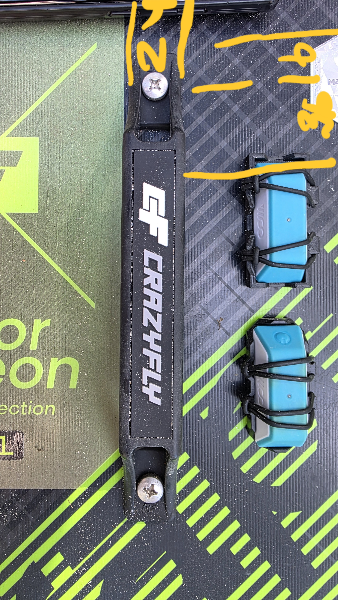
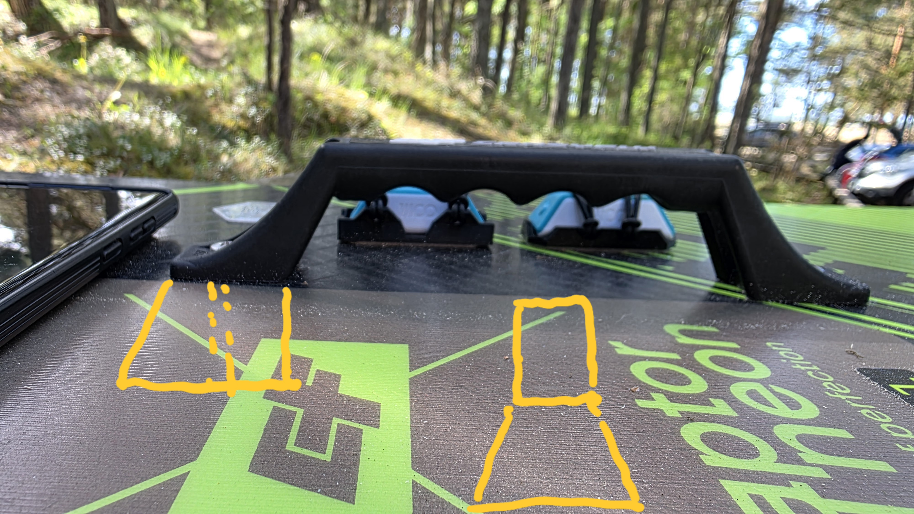
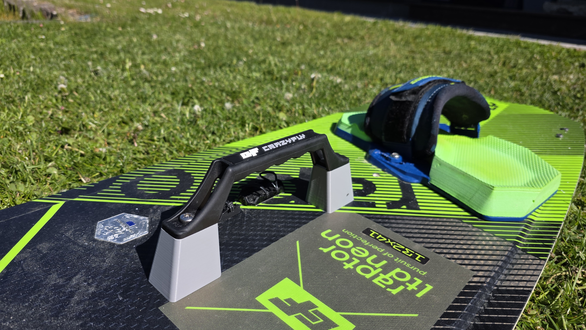
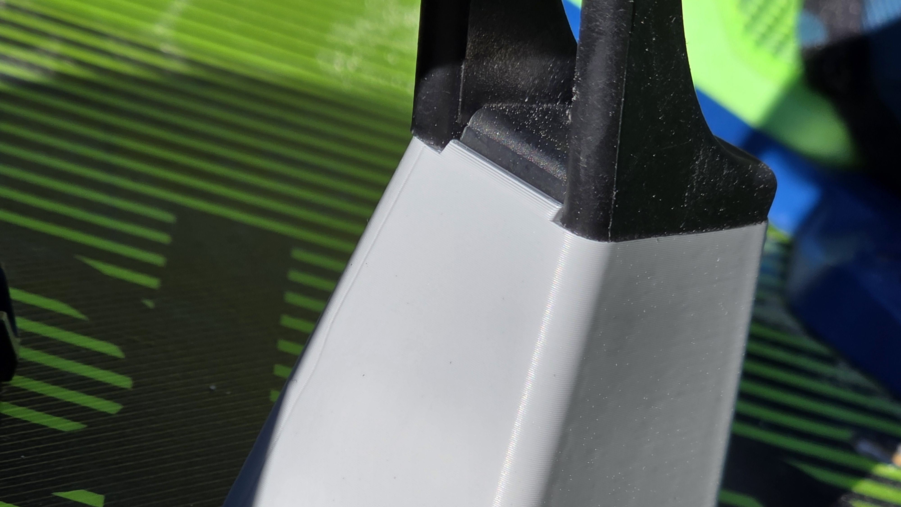

# Kiteboard Handle Spacer

A fully parametric OpenSCAD model of a kiteboard handle spacer designed to raise the grab handle by 47mm. This makes the board much easier to grab during board-offs, handle passes, or when carrying it.

The model features a **right-trapezoid side profile** (sloped on the outer face, vertical on the inner face) to seamlessly match the handle's aesthetics, and a **symmetrically-sloped end profile** with smooth rounded edges for ergonomics and safety.

Additionally, it includes a **custom half-cylinder anti-rotation lip** ($1.5\,\text{mm}$ high, $3\,\text{mm}$ wide, and $14\,\text{mm}$ long) centered on the top edge of the vertical wall to prevent any rotation under load.

## Gallery

### 3D Model Render

### Sketches and Reference Photos
* **Original Handle Top View & Measurements:**
  

* **Handle Profile, Side and End Spacer Sketches:**
  

* **Assembly & Workspace Design Sketch:**
  

* **Detailed Fine-tuning Details:**
  

## Dimensions

The model is configured with your updated defaults:
* **Spacer Height:** 47 mm (raises the handle)
* **Top Width:** 24 mm (transverse to handle)
* **Bottom Width:** 36 mm (transverse to handle)
* **Top Length:** 36 mm (along handle length)
* **Bottom Length:** 45 mm (along handle length)
* **Corner Radius:** 4 mm (vertical edges)
* **Anti-Rotation Lip:** $1.5\,\text{mm}$ high, $3\,\text{mm}$ wide, $14\,\text{mm}$ long half-cylinder on the top-inner edge ($y=0$)
* **Bolt Hole Location:** 20 mm from the flat vertical inner face (fits M6 hardware)

## Files in this Repository

* **`Kiteboard-Handle-Spacer.scad`**: The main parametric OpenSCAD script.
* **`Kiteboard-Handle-Spacer.stl`**: A pre-rendered 3D STL file ready for slicing.
* **`view1.png`**: Preview image of the model.

## Customization

You can open `Kiteboard-Handle-Spacer.scad` in **OpenSCAD** and use the **Customizer panel** to easily adjust:
* Spacer height, length, and width dimensions.
* Bolt hole diameter and placement.
* **Anti-rotation Lip:** Toggle `enable_wall_lip` on/off, change the `wall_lip_height` (cylinder radius), `wall_lip_width` (cylinder diameter), or `wall_lip_length`.
* Corner rounding radius (`corner_radius`).
* **Optional Counterbore:** Enable and configure a top recess for the screw heads/washers.

## Recommended 3D Print Settings

Kiteboarding gear experiences high structural loads, continuous UV exposure, and salt water. For maximum durability, use these settings:

* **Material:** **ASA** (highly recommended for superior UV resistance and strength) or **PETG**. *Avoid PLA*, as it degrades in direct sunlight and can warp in hot cars.
* **Orientation:** Print flat on the bottom face ($z = 0$). **No supports required.**
* **Wall Loops/Perimeters:** **4 or more** (critical for strength around the bolt hole).
* **Infill:** **30% - 40%** (using a strong 3D pattern like **Gyroid** or **Cubic**).

## Hardware Requirements

Since the spacer raises the handle by **47mm**, you will need to replace the original handle screws with longer M6 bolts:
* **Bolt Type:** M6 Marine-Grade Stainless Steel (A4 / 316 grade is highly recommended).
* **Bolt Length:** **60 mm** length is perfectly adjusted for the default 47mm spacer height when using standard round-head Torx bolts.
* **Alternative Bolt Length:** For other heights, use `Original Bolt Length + Spacer Height`.
