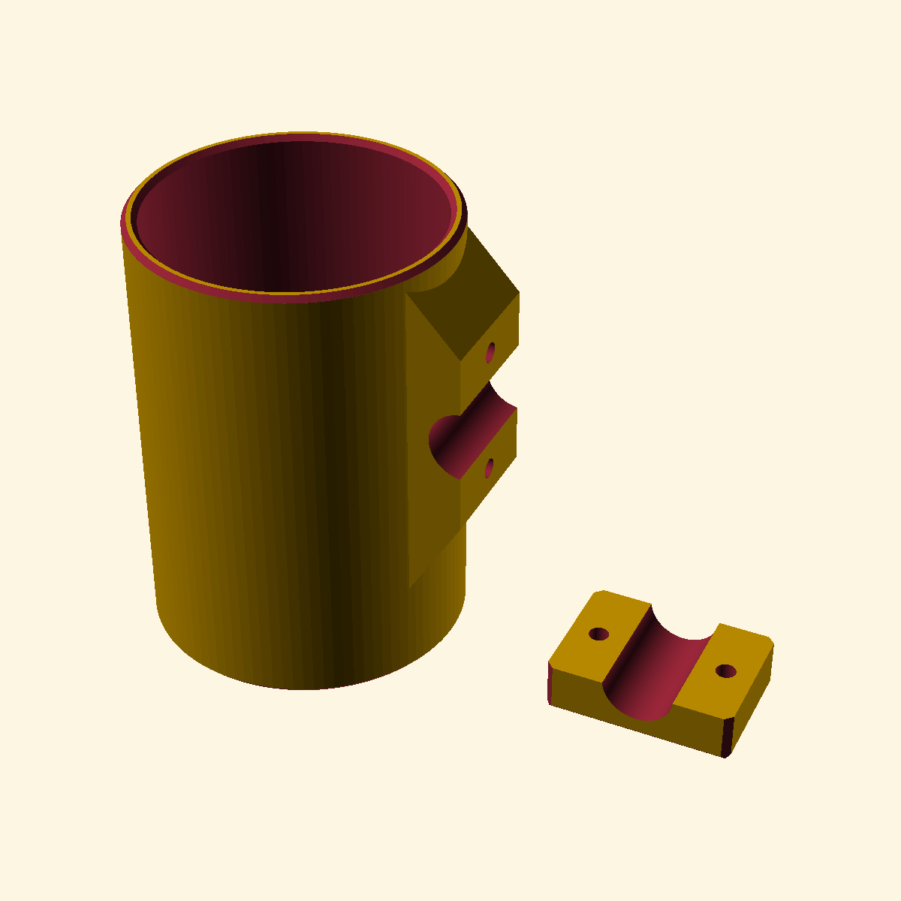
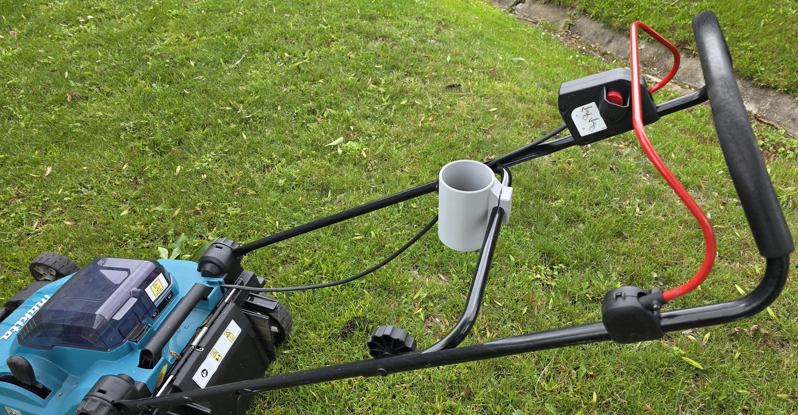
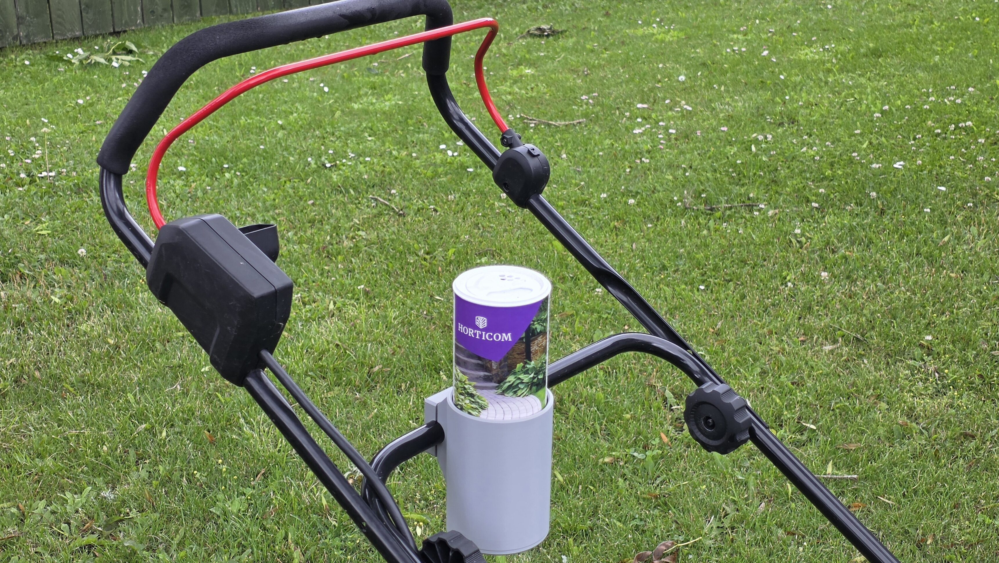

# Lawnmower-Cupholder

A **parametric utility and cup holder** designed in OpenSCAD to clamp securely onto horizontal metal bars or pipes (such as on lawnmowers, strollers, or workshop equipment). It is engineered for durability, vibration resistance, and clean 3D printing.

---

## 📸 Visuals

### 3D Render
The project features a two-part clamping system: the main cup body with an integrated clamp side (blue) and the clamp cap (orange). Both are oriented for optimal print bed contact.

### Real-Life Application
Here is the printed cupholder mounted on the handle bar of a Makita battery-powered lawnmower, showing its exceptionally solid grip and ability to hold utility canisters (like ant repellent or shaker bottles):

| Clamped to Handle Bar | With Utility Canister |
| :---: | :---: |
|  |  |

---

## ✨ Features

- 🔧 **Fully Parametric Design:** Easily customize the cup diameter, cup height, mounting bar/pipe diameter, wall thicknesses, and bolt dimensions within OpenSCAD's Customizer.
- 💪 **Structural Reinforcement:** Features integrated top and bottom **reinforcement gussets (wedges)** on the clamp body to prevent fatigue and bending from lawnmower vibrations.
- ⚙️ **Sacrificial Membrane Design:** The counterbored bolt holes on the clamp cap feature a **0.25mm sacrificial membrane**. This allows the cap to print flat on its back and bridge beautifully, avoiding the need for complex internal supports. After printing, simply poke through the thin layer with a screwdriver or bolt!
- 🕳️ **Dual-Chamfered Drain Hole:** A large 40mm drain hole at the bottom prevents water, wet grass, and dirt from pooling, while the chamfers keep edges smooth and make it easy to push tight-fitting bottles back up.
- 🔩 **Integrated Hardware Capture:** Includes captive hex nut slots on the inside of the cup wall and matching recess pockets for bolt heads on the clamp cap, keeping all hardware flush and neat.

---

## 🔩 Hardware Requirements (Default Configuration)

- **2x M5 Bolts** (e.g., M5 socket head cap screws, length ~25-30mm depending on pipe size)
- **2x M5 Hex Nuts**

The integrated clamping gap of **2.0mm** ensures that as you tighten the bolts, high clamping force is distributed around the pipe.

---

## 🖨️ Recommended Print Settings

To ensure the cupholder withstands outdoor elements and high mechanical stress:

- **Material:** **PETG, ASA, or ABS** is highly recommended. *Avoid PLA*, as it will warp and lose clamping force when exposed to direct sunlight or warm weather.
- **Perimeters / Walls:** **4 or more** (critical for the structural integrity of the clamping ears and threads/nuts).
- **Infill:** **30% to 50%** (using **Gyroid** or **Grid** patterns for maximum three-dimensional rigidity).
- **Supports:** The parts are pre-oriented in `"print"` mode to minimize the need for supports.

---

## 🛠️ How to Customize

1. Open `Lawnmower-Cupholder.scad` in [OpenSCAD](https://openscad.org/).
2. Adjust the parameters in the **Customizer Panel** on the right:
   - **`cup_diameter`**: Set to match your bottle/can (default is `77.0` mm, which perfectly fits utility bottles and large tumblers).
   - **`pipe_diameter`**: Adjust to match your equipment handle diameter (default is `19.0` mm).
   - **`cup_height`**: Adjust the height of the holder (default is `120.0` mm).
3. Use the **`mode`** parameter to preview or export:
   - `"print"`: Places both parts side-by-side, flat on the print bed (recommended for export).
   - `"assembly"`: Displays the parts clamped together around a simulated metal pipe to verify fitment.
   - `"cup"` or `"cap"`: Renders only the individual component.
4. Press **F6** to render the geometry and **F7** to export the STL file.
