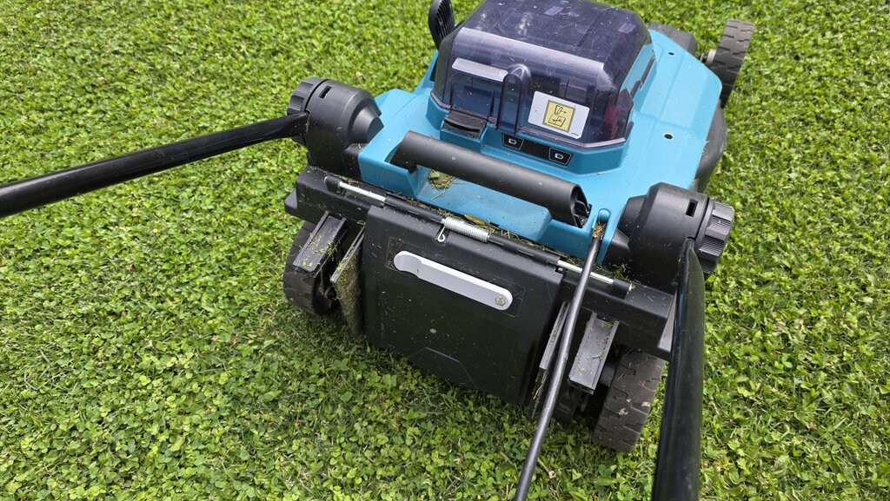
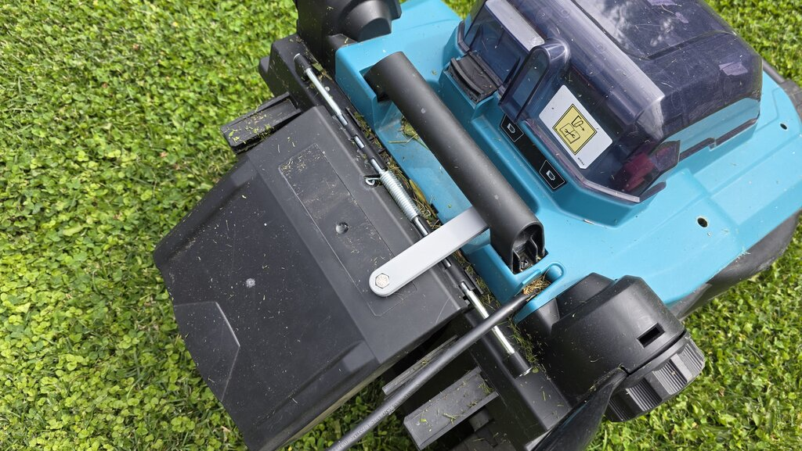
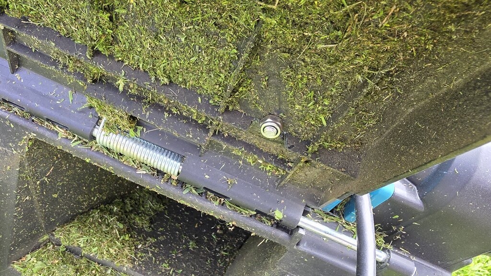

# Makita Lawnmower Hatch Lever

This repository contains a parametric 3D model designed in **OpenSCAD** for a lever that holds open a Makita lawnmower hatch.

The lever pivots on an M6 bolt and rests securely under the mower's round handle bar, keeping the grass-catcher hatch open. This is useful for mulching or operating without the collection bag.

## Render

## Real-World Photos (Lever in Action)

Here is the 3D-printed lever installed on the Makita lawnmower:

### 1. Hatch Closed (Lever in Resting Position)
The lever is mounted to the black hatch door using an M6 bolt. When the hatch is closed, the lever hangs compactly out of the way.

### 2. Hatch Held Open (Lever Engaged under the Handle)
To discharge grass clippings directly, lift the hatch and rotate the lever upwards. The cylindrical cutout hooks perfectly under the round carry handle bar, holding the hatch open securely.

### 3. Mounting Hardware Detail (Underside of Hatch)
The pivot bolt runs through the hatch door, fastened securely on the inside with a washer and an M6 lock nut.

## Default Dimensions
- **Length**: 130 mm
- **Width**: 20 mm
- **Thickness**: 10 mm
- **Chamfer**: 1 mm on all top and bottom edges (making the lever comfortable to handle and removing sharp corners)
- **Pivot Hole**: M6 clearance (Ø6.4 mm), centered 10 mm from the pivot end
- **Hexagonal Nut Recess**: Concentric with the pivot hole, default flat-to-flat size of 10.3 mm (fits M6 nut plus printing tolerance), 4 mm deep on the top surface.
- **Handle Cutout**: Ø32 mm cylinder shape, 5 mm deep, centered 110 mm from the pivot end (creating a natural hook lip at the end)

## Customization
Since the design is fully parametric, you can easily adjust these values inside OpenSCAD (manually or via the Customizer window):
- `lever_length`: Customize the overall reach of the lever.
- `lever_width` & `lever_thickness`: Adjust structural strength.
- `chamfer_size`: Size of the bevel on all outer edges (makes corners less sharp and improves print feel, can be set to 0 for flat edges).
- `bolt_hole_diameter` & `bolt_hole_offset`: Customize for different screws/bolts (e.g., M5, M8).
- `nut_recess_enable`: Toggle the hexagonal nut pocket on/off.
- `nut_recess_flat_to_flat` & `nut_recess_depth`: Customize the size and depth of the hex pocket to fit any standard hex nut or bolt head (e.g. standard M6 nut size is 10mm flat-to-flat).
- `nut_recess_on_top`: Toggle whether the hexagonal pocket is on the top or bottom surface of the lever.
- `cutout_diameter`, `cutout_depth`, `cutout_offset`: Adjust to fit your specific lawnmower handle size and position.
- `cutout_on_top`: Toggle whether the hook cutout is on the top or bottom of the lever.
- `cutout_angle`: Rotate the handle cutout if your handle does not run perpendicular to the lever.
- `resolution`: Control the circle smoothness ($fn).

## 3D Printing Recommendations
- **Material**: **PETG, ASA, or ABS** are highly recommended for outdoor durability, impact strength, and UV/heat resistance. PLA can work but may soften if left in a hot shed or under direct sunlight.
- **Orientation**: Print flat on the print bed (the bottom face is completely flat).
- **Supports**: **None** required!
- **Infill**: 30% to 50% with Gyroid or Grid pattern for solid structural strength.
- **Perimeters**: 4 or more wall lines to ensure the bolt hole and handle cutout areas are robust.
