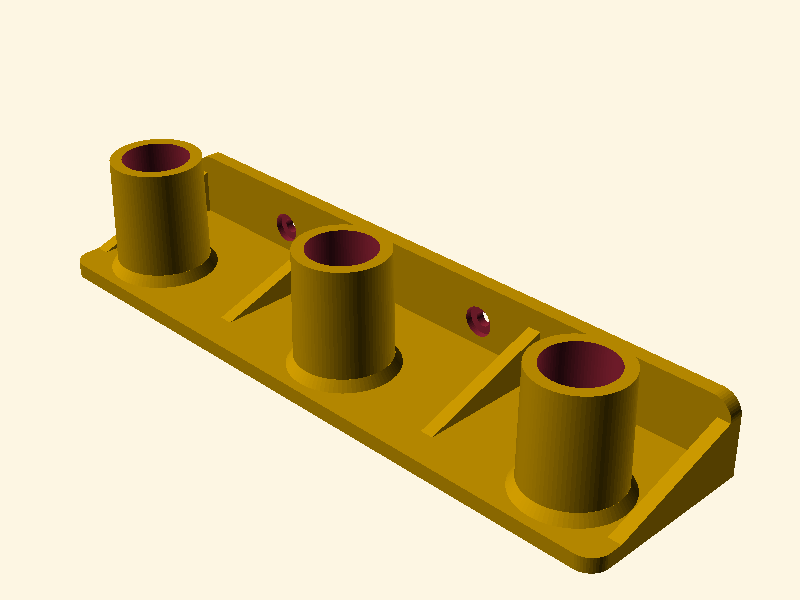

# Makita Vacuum Nozzles Wall & IKEA SKÅDIS Mount

A robust, fully parametric OpenSCAD wall mount designed specifically for **Makita Cordless Vacuum Cleaner (DCL180, DCL182, DCL280, CL106, etc.)** nozzles and accessories.

This design is specifically optimized for both standard spaces and **narrow utility rooms/closets** by offering two distinct, configurable mounting orientations. It features integrated mounting holes matching the **IKEA SKÅDIS 40mm grid** for perfect, sturdy attachment to your pegboard using standard screws, T-nuts, or bolts (M4 or M5).

---

## Mounting Styles (Configurable)

You can easily toggle between two mounting styles using the OpenSCAD Customizer:

1. **`"vertical"` (Default & Recommended for Narrow Spaces)**:
   - **How it works**: The nozzles are held **vertically, parallel to the wall**, hanging down from vertical pegs on a horizontal L-bracket shelf.
   - **Space Savings**: Minimizes the depth of the mount dramatically (down to just the width of the nozzles themselves, approx. 40-50mm total protrusion). This is perfect for narrow hallways, cupboards, and utility closets.
   - **Reinforcements**: The 90° angle between the shelf and vertical wall flange is fully reinforced with **three heavy-duty triangular support gussets (ribs)** (left, right, and center) to handle heavy nozzles without flexing.
   - **Printability**: **100% support-free!** Both the horizontal shelf and the vertical back wall sit flat on the print bed, and the vertical flange, triangular gussets, and pegs stand straight up along the Z-axis.

2. **`"horizontal"`**:
   - **How it works**: The pegs extend horizontally outwards from a flat base plate, holding the nozzles perpendicular to the wall.
   - **Aesthetics**: Offers a very clean, flat-pack look, with pegs tilted 12° upwards to keep nozzles secure via gravity.
   - **Printability**: **100% support-free!** The entire base plate lies flat on the bed, and the angled pegs print vertically upwards.

---

## Technical Features

- **Wedge Friction Fit**: Pegs feature a 1.0mm taper (base diameter 28.0mm, tip diameter 27.0mm) to ensure a snug, non-wobbling wedge fit when accessories are loaded.
- **Dust & Dirt Drains**: Each peg is hollowed out and includes a **6.0mm vertical drain hole** going straight through the bottom shelf/plate. Fine drywall dust, sand, and dirt will fall straight through instead of accumulating inside the pegs!
- **IKEA SKÅDIS Alignment**: Mounting holes are spaced exactly at **40.0mm vertical and horizontal intervals**, matching standard SKÅDIS rows and columns.
- **Perfect Tool Access**: Screw holes are situated on the top and bottom of the vertical flange, while the pegs are at the center of the shelf. This guarantees **completely unobstructed screwdriver or Allen key access** to all mounting screws!
- **Clean Aesthetics**: Smooth rounded corners, and elegant filleted/beveled base collars for peg strength.

---

## Technical Specifications (Default Configuration)

- **Main File**: `Makita-Vacuum-Nozzles-Mount.scad`
- **Output STL**: `Makita-Vacuum-Nozzles-Mount.stl`
- **Nozzle Insert Diameter**: 28.0 mm
- **Peg Length**: 35.0 mm
- **Peg Spacing**: 80.0 mm (fits two nozzles side-by-side)
- **Base Width**: 124 mm
- **Vertical Flange Height**: 64 mm (perfectly matches 2 vertical Skadis slots)
- **Horizontal Shelf Depth**: 51 mm
- **Wall-to-Peg Clearance**: 32 mm (leaves plenty of body clearance for floor and crevice nozzles)
- **Mounting Hole Spacing**: 40.0 mm horizontally, 40.0 mm vertically (perfect SKÅDIS match)
- **Screw Hole Diameter**: 4.5 mm (suits standard M4 bolts or wood screws) with 9.0 mm diameter counterbore recesses for flush screw heads.

---

## 3D Printing Guidelines

To ensure your mount lasts and holds up to repeated insertions and heavy use, follow these slicing guidelines:

| Parameter | Recommended Setting | Reason |
| :--- | :--- | :--- |
| **Orientation** | **Shelf/Base flat on bed** | Gives the highest layer strength, allows support-free printing, and makes screw holes print perfectly. |
| **Supports** | **None** | The 90° vertical back wall, vertical pegs, and 45° angled gussets print flawlessly without any support! |
| **Perimeters / Walls**| **4 or more** | Crucial! Pegs and joints get their strength from perimeters, not infill density. |
| **Infill Density** | **20% to 30%** | Standard density is plenty if perimeters are set to 4+. |
| **Infill Pattern** | **Gyroid** or **Grid** | High torsional and shear strength. |
| **Material** | **PETG**, **ABS/ASA**, or **PLA** | PLA is perfectly fine, but PETG or ASA is recommended for workshop environments with wider temperature swings. |

---

## IKEA SKÅDIS Assembly Tips

- **Screws/Bolts**: Use standard M4 or M5 metric screws/bolts (12mm to 15mm long) and standard T-nuts or custom 3D-printed Skadis nuts.
- **Assembly**: Insert bolts through the counterbored holes from the front of the vertical flange. The recesses hide the screw heads completely.

---

## Customizing in OpenSCAD

The SCAD file is structured with standard OpenSCAD Customizer syntax. To modify dimensions:

1. Open `Makita-Vacuum-Nozzles-Mount.scad` in **OpenSCAD**.
2. Open the **Customizer** panel on the right side of the editor window.
3. Adjust sliders or values as needed:
   - **`mount_style`**: Switch between `"vertical"` (space saver) and `"horizontal"` (flat).
   - **`wall_clearance`**: Adjust how far the nozzles sit from the wall in vertical mode.
   - **`nozzle_diameter`**: If you have a different brand of vacuum, change this to match your wand's female ID.
   - **`num_pegs`**: Set this to `1`, `2`, `3`, `4`, or `5` depending on how many accessories you want to hang.
   - **`peg_spacing`**: If you are hanging very wide nozzles (like floor nozzles), increase spacing to `120.0` or `160.0` (multiples of 40mm).
4. Render (`F6`) and Export to STL (`F7`).

---

## File Structure

- `Makita-Vacuum-Nozzles-Mount.scad`: The primary OpenSCAD file (v0.04).
- `Makita-Vacuum-Nozzles-Mount.stl`: Slicing-ready compiled mesh generated with default vertical parameters.
- `Makita-Vacuum-Nozzles-Mount.png`: Visual preview image of the rendered vertical design.

---

## Version History

- **v0.04 (2026-07-10)**: Removed the optional engraved text label option completely, ensuring a clean, minimal design surface.
- **v0.03 (2026-07-10)**: Corrected vertical back wall location and orientation to stand **upwards** from the shelf, forming a true L-bracket. Added `half_rounded_plate` module for perfectly flush 90° corners on the left and right sides.
- **v0.02 (2026-07-10)**: Added `"vertical"` space-saving L-bracket style with heavy-duty triangular gussets, horizontal screw hole counterbores, and upright front-face text engraving. Retained `"horizontal"` flat-plate style as an option.
- **v0.01 (2026-07-10)**: Initial release. Fully parametric horizontal mount flat-plate style.

---

*Designed with precision for functional workspace organization.*
