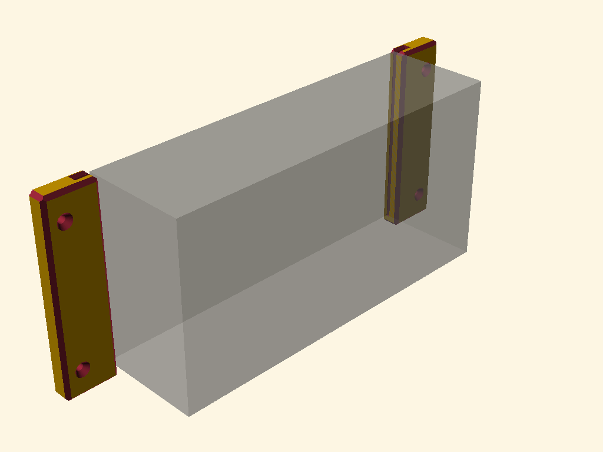
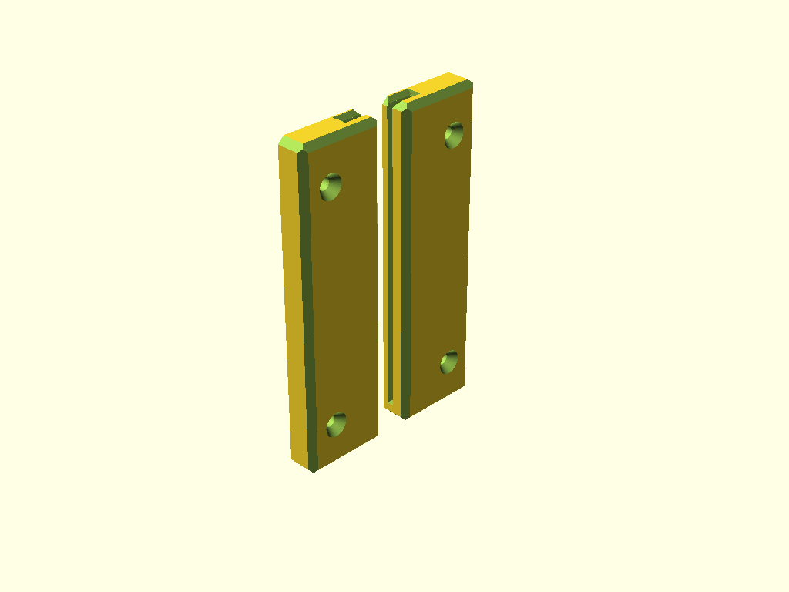

# MantaFoils Takeoff Standard Charger Wall Mount

A fully parametric, 3D-printable vertical wall mounting bracket system for the **MantaFoils Takeoff Standard Charger** power brick.

The mount consists of two mirrored brackets (Left and Right) that screw flat onto a wall. The charger slides vertically into the brackets from the top using its integrated end-cap metal ears, providing a secure, flush-fit, and completely **tool-free sliding mounting solution**.

---

## Features

- **Flush-Wall Mounting**: The back planes ($Y=0$) are kept perfectly flat and sharp, ensuring the brackets seat fully flush against the wall without gaps.
- **Symmetrical 3D Chamfering**: Features sleek $45^\circ$ vertical and horizontal corner chamfers on all front and side edges.
- **Easy Insertion**: A simple $1.5\text{ mm}$ $45^\circ$ bevel runs along the front and back horizontal entry lips of the slot, acting as a guide channel for effortless drop-in.
- **Zero-Scratches Wall Clearance**: Includes a $2\text{ mm}$ backplate layer (`slot_wall_clearance`) that separates the metal ears from your wall to prevent scraping.
- **Integrated Screw Recesses**: Screw holes are perfectly positioned in the solid outer flange ($20\text{ mm}$ wide), matching standard **4mm wood screws with countersunk heads**. The screw heads sit fully recessed, completely clear of the sliding path.
- **Highly Parametric**: Compatible with OpenSCAD's **Customizer** panel. Easily customize tolerances, charger thickness, slot depth, or mounting screw dimensions.
- **No-Support Printing**: Designed to be printed standing upright with absolutely **zero supports**.

---

## Files in this Repository

- [`Mantafoils-Takeoff-Standar-Charger-Mount.scad`](Mantafoils-Takeoff-Standar-Charger-Mount.scad): Core parametric OpenSCAD source file.
- [`Mantafoils-Takeoff-Standar-Charger-Mount.png`](Mantafoils-Takeoff-Standar-Charger-Mount.png): Pre-rendered visual mockup of the brackets installed on a wall supporting the charger case.
- [`Mantafoils-Takeoff-Standar-Charger-Mount-printable.png`](Mantafoils-Takeoff-Standar-Charger-Mount-printable.png): Pre-rendered view of the brackets aligned flat on a 3D-printer bed.

---

## 3D Printing Instructions

For best performance, print both brackets simultaneously using the default `"both"` part layout in OpenSCAD:

1. **Orientation**: Print **standing vertically upright** (Z-axis vertical, sitting on the flat bottom faces). No supports are required!
2. **Material**: **PETG, ABS, or ASA** is highly recommended. These materials withstand any minor heat generated by the charger and offer superior screw pull-out strength compared to PLA.
3. **Walls & Infill**: 
   - **Perimeters/Walls**: 3 to 4 walls/loops (extremely important for screw-hole rigidity).
   - **Infill**: 20% to 30% Gyroid or Grid infill.

---

## Parametric Customization

To modify the bracket dimensions or adapt them for a different charger:
1. Open [`Mantafoils-Takeoff-Standar-Charger-Mount.scad`](Mantafoils-Takeoff-Standar-Charger-Mount.scad) in **OpenSCAD**.
2. Expand the **Customizer** panel on the right.
3. Tweak parameters as needed. The most common settings include:
   - `part`: Swap between `"both"` (printable layout), `"left"`, `"right"`, or `"layout"` (installed preview with mockup).
   - `slot_bevel`: Adjust the size of the slot's top horizontal entry chamfer.
   - `screw_shaft_dia` / `screw_head_dia`: Customize for other screw dimensions.
4. Render (press **F6**) and export as STL (press **F7**).

---

## License

This project is open-source and licensed under the **MIT License**.
