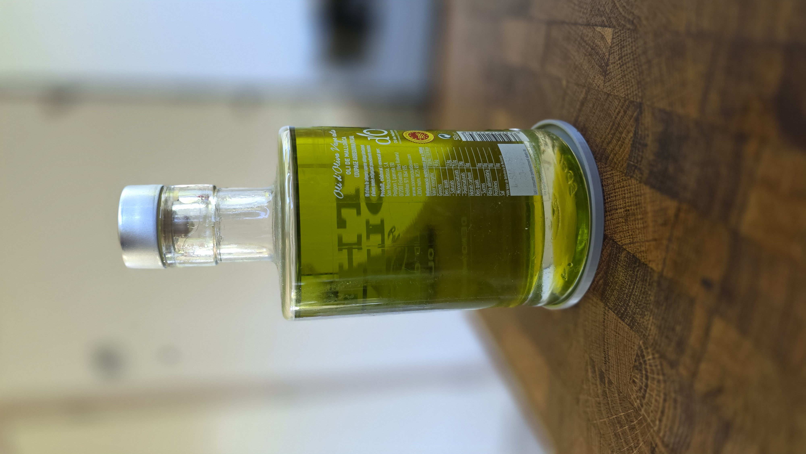

# Oil Bottle Base

A parametric OpenSCAD design for a bottle base designed to protect surfaces from oil drips.

## Overview
This project provides a simple, 3D-printable tray specifically sized for oil bottles with a diameter of 87mm. The base is parametric, allowing for easy adjustments to diameter, wall thickness, and chamfer sizes.

## Features
- **Parametric Design:** Easily adjustable dimensions via OpenSCAD parameters.
- **Edge Chamfers:** Beveled inner and outer edges for improved aesthetics and ease of use.
- **Surface Protection:** Designed to catch drips and prevent oil from staining tables or countertops.

## Usage
1. Open `Oil-Bottle-Base.scad` in [OpenSCAD](https://openscad.org/).
2. Adjust parameters in the Customizer if needed.
3. Render (F6) and Export as STL (F7).
4. Print with your preferred 3D printer settings.

## Project Files
- `Oil-Bottle-Base.scad`: The source OpenSCAD file.
- `Oil-Bottle-Base.stl`: Pre-exported STL file.
- `Oil-Bottle-Base.png`: Visual preview of the design.
