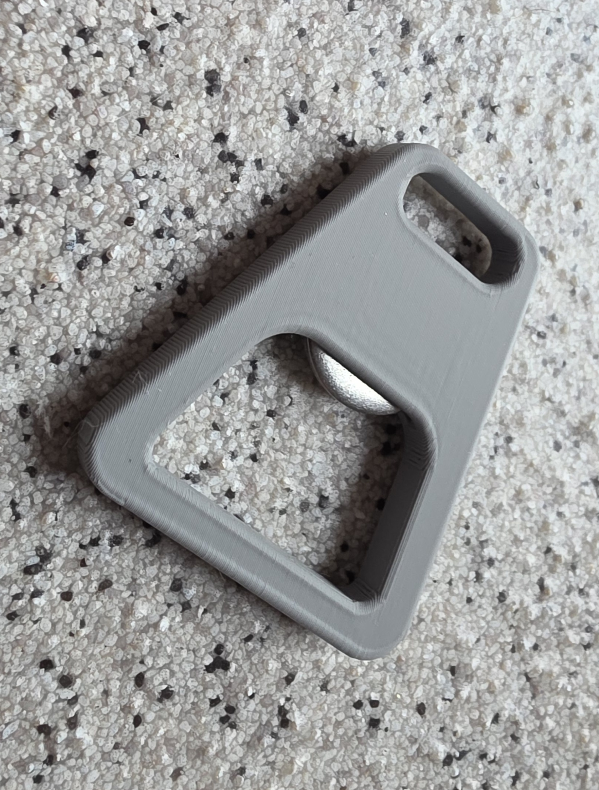
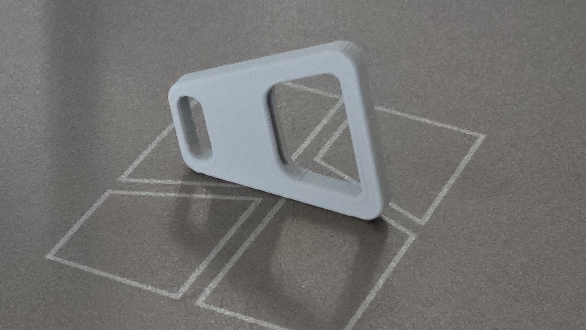
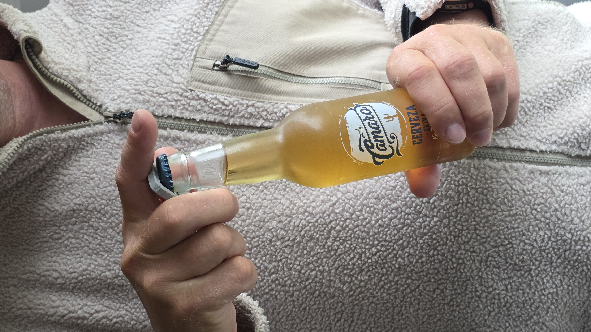

# Pocket Coin-Op Bottle Opener (Remix v1.14)

An upgraded, highly optimized, and ergonomic parametric 3D-printable bottle opener in OpenSCAD.

* **Original Design**: Originally designed by [br3ttb on Thingiverse](https://www.thingiverse.com/thing:11025/files).
* **License**: Creative Commons - Attribution - ShareAlike [CC BY-SA](https://creativecommons.org/licenses/by-sa/4.0/).

---

## Gallery / Reference Images

### Model Preview

### Assembly & Photos

---

## Key Upgrades in this Remix

1. **Ultra-Fast Edge Rounding (No Minkowski)**
   Instead of using the expensive, slow 3D `minkowski()` operator, all top and bottom horizontal fillets are achieved using a custom **stacked 2D-offset extrusion** (`beveledExtrude` & `beveledCutoutExtrude`). This computes instantly (sub-second render times in F5/F6)!
   
2. **Rounded Cutouts**
   Both the central bottle-cap hole and the keyring slot feature smooth, flared, rounded top/bottom edges for a highly premium, smooth hand-feel.

3. **High-Strength, Support-Less Layout (`printOnSide`)**
   Set `printOnSide = true` (default) to stand the model vertically on its long side edge.
   * **Strength**: Reorienting the layers 90° ensures leverage stress runs *along* printed filament strands rather than pulling layers apart (prevents delamination).
   * **Ease**: Standing on its long flat edge allows printing with **zero supports**!

4. **Interactive Hardware Preview (`showWasher`)**
   Visualizes a silver stainless steel washer sitting perfectly in the slot. Set `showWasher = $preview;` (default) to show the washer in F5 Preview, but automatically hide it during F6 compilation so it doesn't export in your printable STL.

5. **Configurable Hardware**
   Configured using clear `coinDiameter` (defaults to `19 - 5 = 14mm`) and `coinThickness` (`1.9mm`) variables instead of internal radius formulas.

---

## 3D Printing Recommendations

* **Orientation**: Keep `printOnSide = true` to print standing up on its edge.
* **Material**: PETG, ABS, ASA, or tough PLA.
* **Perimeters/Walls**: Use **4+ perimeters** (walls) for structural toughness.
* **Infill**: **50% or higher** (Gyroid or Grid infill) for rigid leverage.
* **Nozzle/Layers**: `0.2mm` layer height with standard `0.4mm` nozzle works perfectly.
* **Post-Processing**: Press-fit or glue in a standard coin or metal washer of matching dimensions into the pocket, then crack open a cold drink!
