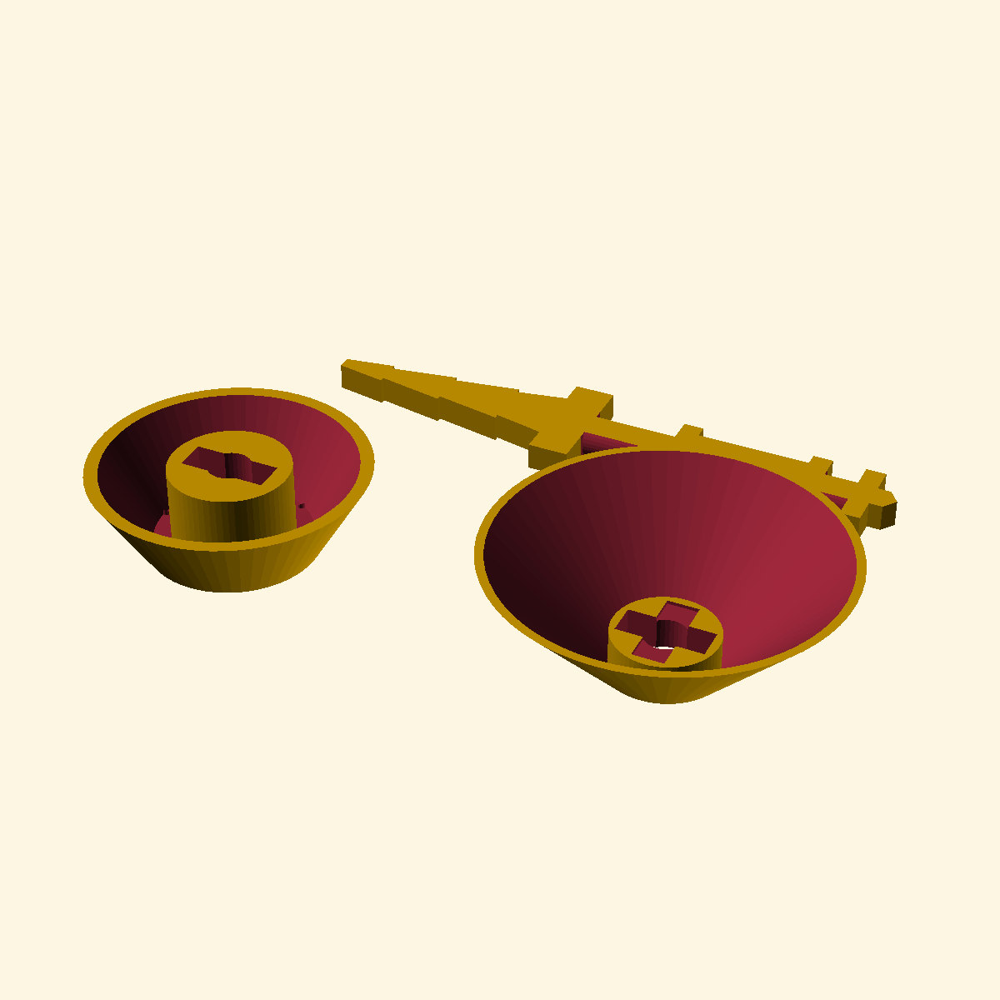
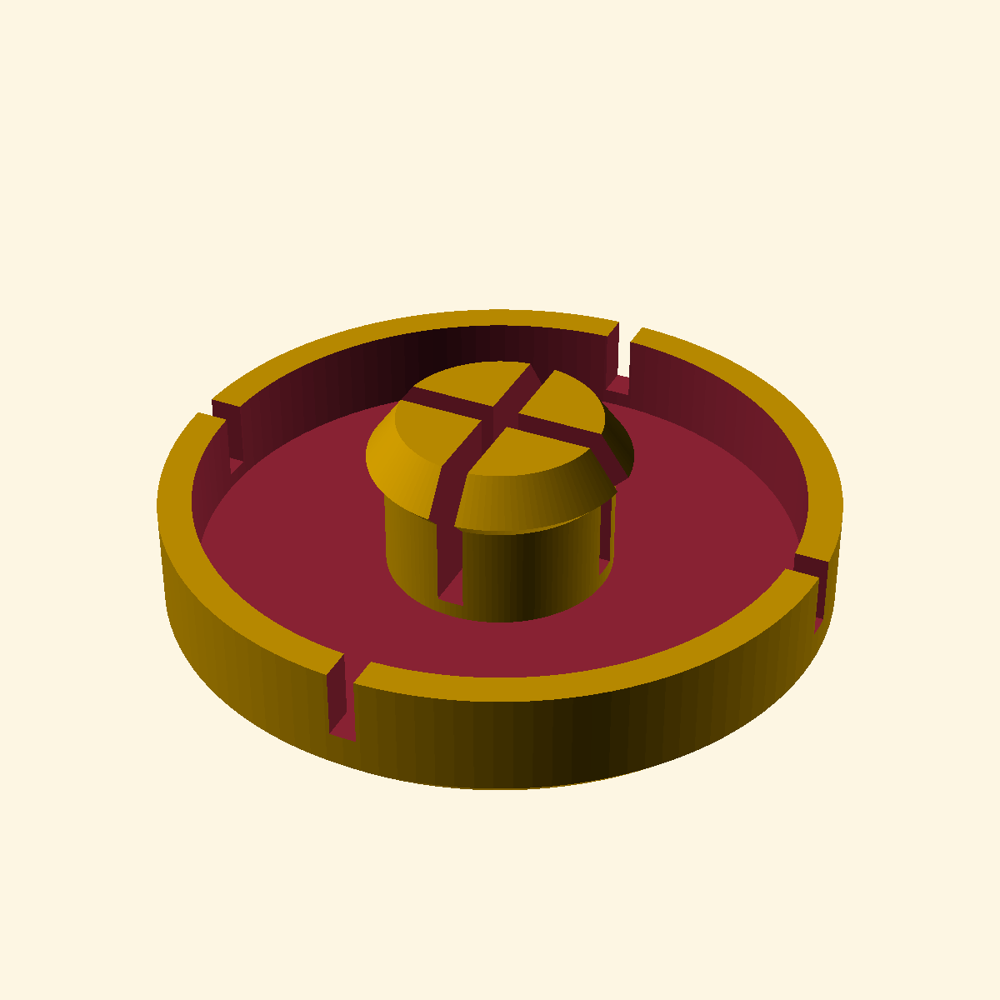
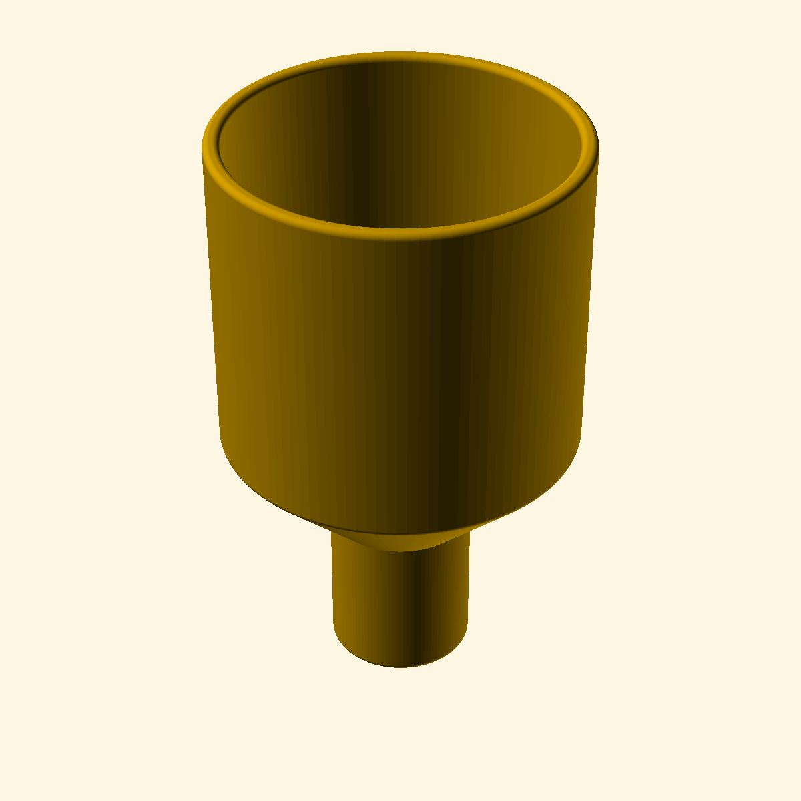
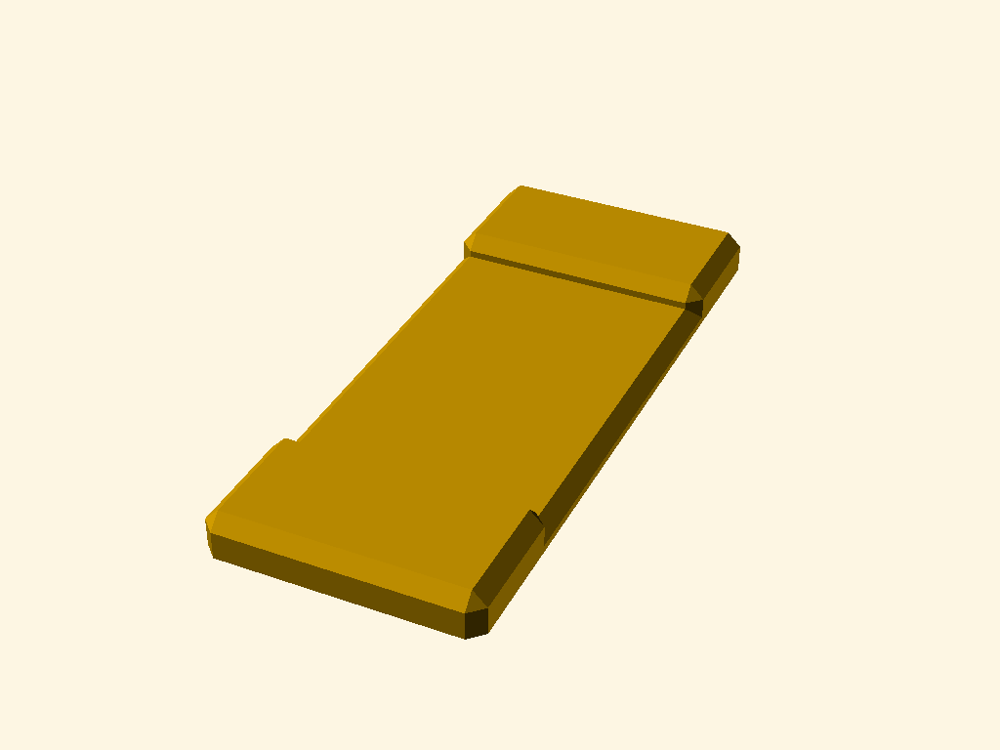
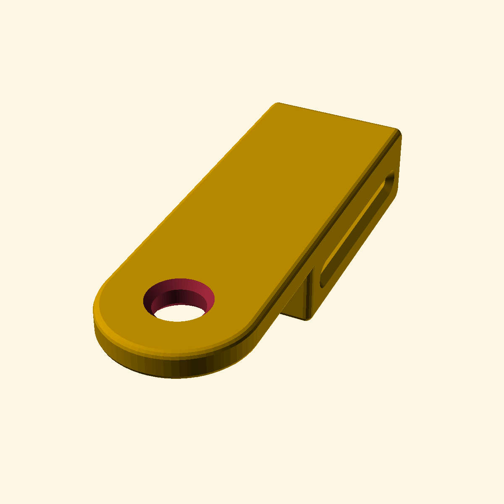
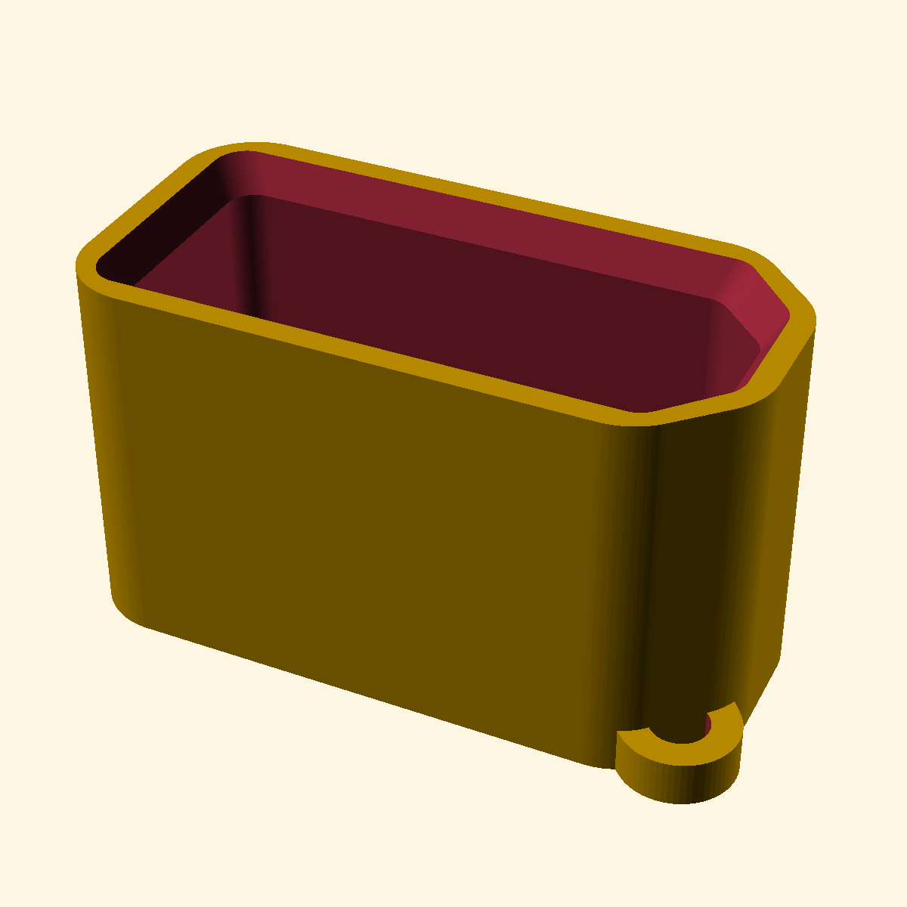
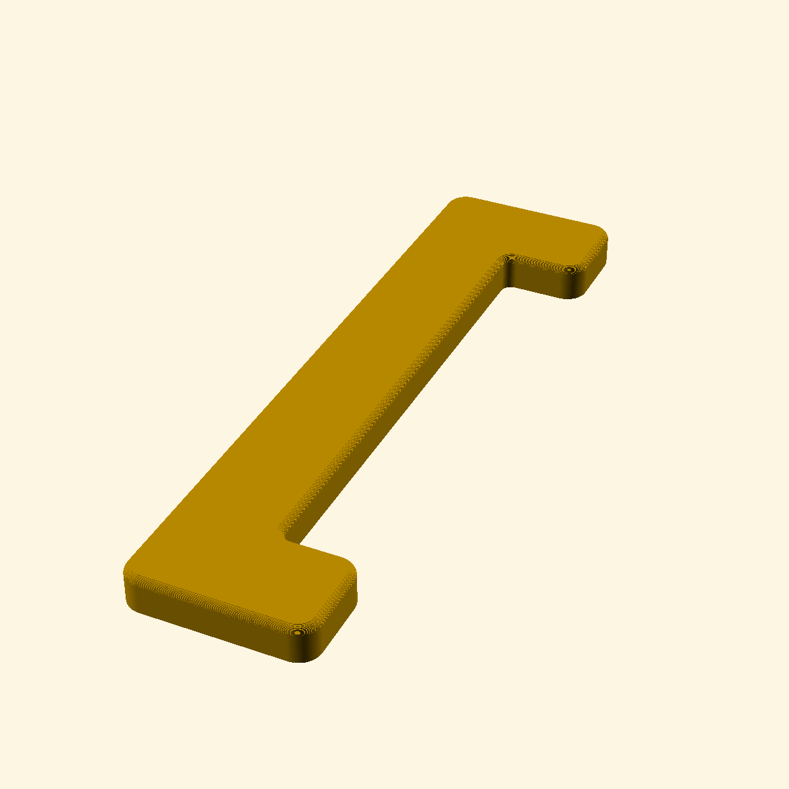

# OpenSCAD Thumbnail Gallery v0.15

This gallery contains all OpenSCAD designs in this repository with their visual representations.

## Gallery

<table style="width: 100%; border-collapse: collapse;">
  <tbody>
    <tr>
      <td style="width: 33%; vertical-align: top;">

  
  
<a href="Slug-Trap" style="color: inherit; text-decoration: none;">Slug Trap</a>

</td>
      <td style="width: 33%; vertical-align: top;">

  
  
<a href="Thumb-Knob" style="color: inherit; text-decoration: none;">Thumb Knob</a>

</td>
      <td style="width: 33%; vertical-align: top;">

  
  
<a href="Dummy-Knob" style="color: inherit; text-decoration: none;">Dummy Knob</a>

</td>
    </tr>
    <tr>
      <td style="width: 33%; vertical-align: top;">

  
  
<a href="GoPro-Bolt-Adapter" style="color: inherit; text-decoration: none;">GoPro Bolt Adapter</a>

</td>
      <td style="width: 33%; vertical-align: top;">

  
  
<a href="Soap-Funnel" style="color: inherit; text-decoration: none;">Soap Funnel</a>

</td>
      <td style="width: 33%; vertical-align: top;">

  
  
<a href="Cargo-Strap-Guide" style="color: inherit; text-decoration: none;">Cargo Strap Guide</a>

</td>
    </tr>
    <tr>
      <td style="width: 33%; vertical-align: top;">

  
  
<a href="Cargo-Strap-Mast-Fix" style="color: inherit; text-decoration: none;">Cargo Strap Mast Fix</a>

</td>
      <td style="width: 33%; vertical-align: top;">

  
  
<a href="EasyDrive-Charger-Holder" style="color: inherit; text-decoration: none;">EasyDrive Charger Holder</a>

</td>
      <td style="width: 33%; vertical-align: top;">

  
  
<a href="XT90-Cap" style="color: inherit; text-decoration: none;">XT90 Cap</a>

</td>
    </tr>
    <tr>
      <td style="width: 33%; vertical-align: top;">

  
  
<a href="EasyDrive-Box-Stops" style="color: inherit; text-decoration: none;">EasyDrive Box Stops</a>

</td>
      <td style="width: 33%; vertical-align: top;">

  
  
<a href="Cable-Comb" style="color: inherit; text-decoration: none;">Cable Comb</a>

</td>
      <td style="width: 33%; vertical-align: top;">

  
  
<a href="Pocket-Coin-Op-Bottle-Opener" style="color: inherit; text-decoration: none;">Pocket Coin Op Bottle Opener</a>

</td>
    </tr>
    <tr>
      <td style="width: 33%; vertical-align: top;">

  
  
<a href="ZBT-2-Wall-Mount" style="color: inherit; text-decoration: none;">ZBT 2 Wall Mount</a>

</td>
      <td style="width: 33%; vertical-align: top;">

  
  
<a href="Raddle-Master" style="color: inherit; text-decoration: none;">Raddle Master</a>

</td>
      <td style="width: 33%; vertical-align: top;">

  
  
<a href="Makita-Lawnmower-Hatch-Lever" style="color: inherit; text-decoration: none;">Makita Lawnmower Hatch Lever</a>

</td>
    </tr>
    <tr>
      <td style="width: 33%; vertical-align: top;">

  
  
<a href="Lawnmower-Cupholder" style="color: inherit; text-decoration: none;">Lawnmower Cupholder</a>

</td>
      <td style="width: 33%; vertical-align: top;">

  
  
<a href="Locker-Washer" style="color: inherit; text-decoration: none;">Locker Washer</a>

</td>
      <td style="width: 33%; vertical-align: top;">

  
  
<a href="Spacer" style="color: inherit; text-decoration: none;">Spacer</a>

</td>
    </tr>
    <tr>
      <td style="width: 33%; vertical-align: top;">

  
  
<a href="Makita-Vacuum-Nozzles-Mount" style="color: inherit; text-decoration: none;">Makita Vacuum Nozzles Mount</a>

</td>
      <td style="width: 33%; vertical-align: top;">

  
  
<a href="IKEA-BROGRUND-Battery-Knob" style="color: inherit; text-decoration: none;">IKEA BROGRUND Battery Knob</a>

</td>
      <td style="width: 33%; vertical-align: top;">

  
  
<a href="D-Fruit-USB-HUB-Holder" style="color: inherit; text-decoration: none;">D Fruit USB HUB Holder</a>

</td>
    </tr>
    <tr>
      <td style="width: 33%; vertical-align: top;">

  
  
<a href="Knob" style="color: inherit; text-decoration: none;">Knob</a>

</td>
      <td style="width: 33%; vertical-align: top;">

  
  
<a href="Round-to-Flat" style="color: inherit; text-decoration: none;">Round to Flat</a>

</td>
      <td style="width: 33%; vertical-align: top;">

  
  
<a href="DIN-Mount" style="color: inherit; text-decoration: none;">DIN Mount</a>

</td>
    </tr>
    <tr>
      <td style="width: 33%; vertical-align: top;">

  
  
<a href="Electrical-Box-Plugs" style="color: inherit; text-decoration: none;">Electrical Box Plugs</a>

</td>
      <td style="width: 33%; vertical-align: top;">

  
  
<a href="Mantafoils-Takeoff-Standar-Charger-Mount" style="color: inherit; text-decoration: none;">Mantafoils Takeoff Standar Charger Mount</a>

</td>
      <td style="width: 33%; vertical-align: top;">

  
  
<a href="Ligerus-Blank" style="color: inherit; text-decoration: none;">Ligerus Blank</a>

</td>
    </tr>
    <tr>
      <td style="width: 33%; vertical-align: top;">

  
  
<a href="Oil-Bottle-Base" style="color: inherit; text-decoration: none;">Oil Bottle Base</a>

</td>
      <td style="width: 33%; vertical-align: top;">

  
  
<a href="IKEA-BROGRUND-Battery-Holder" style="color: inherit; text-decoration: none;">IKEA BROGRUND Battery Holder</a>

</td>
      <td style="width: 33%; vertical-align: top;">

  
  
<a href="Step-Ladder-Feet" style="color: inherit; text-decoration: none;">Step Ladder Feet</a>

</td>
    </tr>
    <tr>
      <td style="width: 33%; vertical-align: top;">

  
  
<a href="OSRAM-Nightlux-Stair-Mount" style="color: inherit; text-decoration: none;">OSRAM Nightlux Stair Mount</a>

</td>
      <td style="width: 33%; vertical-align: top;">

  
  
<a href="Bolt-End-Cap" style="color: inherit; text-decoration: none;">Bolt End Cap</a>

</td>
      <td style="width: 33%; vertical-align: top;">

  
  
<a href="Makita-2xLXT-Carry-Handle" style="color: inherit; text-decoration: none;">Makita 2xLXT Carry Handle</a>

</td>
    </tr>
    <tr>
      <td style="width: 33%; vertical-align: top;">

  
  
<a href="ADO-AIR-Carbon-Rear-Rack-Stand" style="color: inherit; text-decoration: none;">ADO AIR Carbon Rear Rack Stand</a>

</td>
      <td style="width: 33%; vertical-align: top;">

  
  
<a href="Faucet-Valve-Handle" style="color: inherit; text-decoration: none;">Faucet Valve Handle</a>

</td>
      <td style="width: 33%; vertical-align: top;">

  
  
<a href="Surfboard-Airvent-Socket" style="color: inherit; text-decoration: none;">Surfboard Airvent Socket</a>

</td>
    </tr>
    <tr>
      <td style="width: 33%; vertical-align: top;">

  
  
<a href="RayFoil-Stand" style="color: inherit; text-decoration: none;">RayFoil Stand</a>

</td>
      <td style="width: 33%; vertical-align: top;">

  
  
<a href="Terrace-Bench" style="color: inherit; text-decoration: none;">Terrace Bench</a>

</td>
      <td style="width: 33%; vertical-align: top;">

  
  
<a href="Kiteboard-Handle-Spacer" style="color: inherit; text-decoration: none;">Kiteboard Handle Spacer</a>

</td>
    </tr>
    <tr>
      <td style="width: 33%; vertical-align: top;">

  
  
<a href="SUP-Nozzle" style="color: inherit; text-decoration: none;">SUP Nozzle</a>

</td>
      <td style="width: 33%; vertical-align: top;">

  
  
<a href="Headphone-Hook" style="color: inherit; text-decoration: none;">Headphone Hook</a>

</td>
      <td style="width: 33%; vertical-align: top;">

  
  
<a href="Threaded-Plug" style="color: inherit; text-decoration: none;">Threaded Plug</a>

</td>
    </tr>
    <tr>
      <td style="width: 33%; vertical-align: top;">

  
  
<a href="KT-SuperK2-120-Noserest" style="color: inherit; text-decoration: none;">KT SuperK2 120 Noserest</a>

</td>
      <td style="width: 33%; vertical-align: top;">

  
  
<a href="Gustavsberg-Hydrant-Valve-Key" style="color: inherit; text-decoration: none;">Gustavsberg Hydrant Valve Key</a>

</td>
      <td style="width: 33%; vertical-align: top;">

  
  
<a href="Pole-Mount-Post" style="color: inherit; text-decoration: none;">Pole Mount Post</a>

</td>
    </tr>
    <tr>
      <td style="width: 33%; vertical-align: top;">

  
  
<a href="Caliper-Notched-Jaws" style="color: inherit; text-decoration: none;">Caliper Notched Jaws Bolted</a>

</td>
      <td style="width: 33%; vertical-align: top;">

  
  
<a href="Caliper-Notched-Jaws" style="color: inherit; text-decoration: none;">Caliper Notched Jaws</a>

</td>
      <td style="width: 33%; vertical-align: top;">

  
  
<a href="Samsung-UE55-Stand-Spacer" style="color: inherit; text-decoration: none;">Samsung UE55 Stand Spacer Symmetrical</a>

</td>
    </tr>
    <tr>
      <td style="width: 33%; vertical-align: top;">

  
  
<a href="Samsung-UE55-Stand-Spacer" style="color: inherit; text-decoration: none;">Samsung UE55 Stand Spacer</a>

</td>
      <td style="width: 33%; vertical-align: top;">

  
  
<a href="Square-Post-Molding" style="color: inherit; text-decoration: none;">Square Post Molding</a>

</td>
      <td style="width: 33%; vertical-align: top;">

  
  
<a href="Charger-11S-Holder" style="color: inherit; text-decoration: none;">Charger 11S Holder</a>

</td>
    </tr>
    <tr>
      <td style="width: 33%; vertical-align: top;">

  
  
<a href="Toothbrush-Array" style="color: inherit; text-decoration: none;">Toothbrush Array</a>

</td>
      <td style="width: 33%; vertical-align: top;">

  
  
<a href="Toothbrush-Carousel" style="color: inherit; text-decoration: none;">Toothbrush Carousel</a>

</td>
      <td style="width: 33%; vertical-align: top;">

  
  
<a href="Pipe-Plug" style="color: inherit; text-decoration: none;">Pipe Plug WS85</a>

</td>
    </tr>
    <tr>
      <td style="width: 33%; vertical-align: top;">

  
  
<a href="Pipe-Plug" style="color: inherit; text-decoration: none;">Pipe Washer</a>

</td>
      <td style="width: 33%; vertical-align: top;">

  
  
<a href="Pipe-Spacer" style="color: inherit; text-decoration: none;">Pipe Spacer</a>

</td>
      <td style="width: 33%; vertical-align: top;">

  
  
<a href="Pipe-Plug" style="color: inherit; text-decoration: none;">Pipe Plug</a>

</td>
    </tr>
    <tr>
      <td style="width: 33%; vertical-align: top;">

  
  
<a href="Pipe-Plug" style="color: inherit; text-decoration: none;">Pipe Cap</a>

</td>
      <td style="width: 33%; vertical-align: top;">

  
  
<a href="Pipe-Spacer" style="color: inherit; text-decoration: none;">Pipe Bracket</a>

</td>
      <td style="width: 33%; vertical-align: top;">

  
  
<a href="NEWONE-Unlocking-PIN" style="color: inherit; text-decoration: none;">NEWONE Unlocking PIN</a>

</td>
    </tr>
    <tr>
      <td style="width: 33%; vertical-align: top;">

  
  
<a href="Foil-Track-Nut-Holder" style="color: inherit; text-decoration: none;">Foil Track Nut Holder</a>

</td>
      <td style="width: 33%; vertical-align: top;">

  
  
<a href="Foil-Track-Nut-Holder" style="color: inherit; text-decoration: none;">Foil Track Nut Holder_backup</a>

</td>
      <td style="width: 33%; vertical-align: top;">

  
  
<a href="Foil-Track-Nut-Holder" style="color: inherit; text-decoration: none;">Foil Track Nut Holder 0.13</a>

</td>
    </tr>
    <tr>
      <td style="width: 33%; vertical-align: top;">

  
  
<a href="Foil-Track-Nut-Holder" style="color: inherit; text-decoration: none;">Foil Track Nut Holder v0.12</a>

</td>
      <td style="width: 33%; vertical-align: top;">

  
  
<a href="USB-Cap" style="color: inherit; text-decoration: none;">USB Cap</a>

</td>
      <td style="width: 33%; vertical-align: top;">

  
  
<a href="Apollo-AIR-1-Wall-Mount" style="color: inherit; text-decoration: none;">Apollo AIR 1 Wall Mount</a>

</td>
    </tr>
    <tr>
      <td style="width: 33%; vertical-align: top;">

  
  
<a href="Surface-Mount-Box" style="color: inherit; text-decoration: none;">Surface Mount Box</a>

</td>
      <td style="width: 33%; vertical-align: top;">

  
  
<a href="IKEA-LIBOJ-E2010-Phone-Stand" style="color: inherit; text-decoration: none;">IKEA LIBOJ E2010 Phone Holder</a>

</td>
      <td style="width: 33%; vertical-align: top;">

  
  
<a href="Toothbrush-Stand" style="color: inherit; text-decoration: none;">Toothbrush Stand</a>

</td>
    </tr>
    <tr>
      <td style="width: 33%; vertical-align: top;">

  
  
<a href="IKEA-LIBOJ-E2010-Phone-Stand" style="color: inherit; text-decoration: none;">IKEA LIBOJ E2010 Phone Holder groovy</a>

</td>
      <td style="width: 33%; vertical-align: top;">

  
  
<a href="IKEA-LIBOJ-E2010-Phone-Stand" style="color: inherit; text-decoration: none;">IKEA LIBOJ E2010 Phone Stand</a>

</td>
      <td style="width: 33%; vertical-align: top;">

  
  
<a href="Tile-Glue-Applicator" style="color: inherit; text-decoration: none;">Tile Glue Applicator</a>

</td>
    </tr>
    <tr>
      <td style="width: 33%; vertical-align: top;">

  
  
<a href="Minecraft-Keychain" style="color: inherit; text-decoration: none;">Minecraft Keychain</a>

</td>
      <td style="width: 33%; vertical-align: top;">

  
  
<a href="Pole-Mount-Rectangular" style="color: inherit; text-decoration: none;">Pole Mount Rectangular</a>

</td>
      <td style="width: 33%; vertical-align: top;">

  
  
<a href="GalaxyTab2Active-Wall-Mount" style="color: inherit; text-decoration: none;">GalaxyTab2Active Wall Mount</a>

</td>
    </tr>
    <tr>
      <td style="width: 33%; vertical-align: top;">

  
  
<a href="Vacuum-Adapter-31mm-to-31mm" style="color: inherit; text-decoration: none;">Vacuum Adapter 31mm to 31mm</a>

</td>
      <td style="width: 33%; vertical-align: top;">

  
  
<a href="Monitor-Nametag" style="color: inherit; text-decoration: none;">Monitor Nametag</a>

</td>
      <td style="width: 33%; vertical-align: top;">

  
  
<a href="DIN-Mount" style="color: inherit; text-decoration: none;">WeMos Mini Cover</a>

</td>
    </tr>
    <tr>
      <td style="width: 33%; vertical-align: top;">

  
  
<a href="DIN-Mount" style="color: inherit; text-decoration: none;">WeMos Mini</a>

</td>
      <td style="width: 33%; vertical-align: top;">

  
  
<a href="DIN-Mount" style="color: inherit; text-decoration: none;">CT Holder</a>

</td>
      <td style="width: 33%; vertical-align: top;">

  
  
<a href="DIN-Mount" style="color: inherit; text-decoration: none;">Serial Energy Meter PCB</a>

</td>
    </tr>
    <tr>
      <td style="width: 33%; vertical-align: top;">

  
  
<a href="DIN-Mount" style="color: inherit; text-decoration: none;">Serial Energy Meter PCB Cover</a>

</td>
      <td style="width: 33%; vertical-align: top;">

  
  
<a href="Sushi-Roll-Cutter" style="color: inherit; text-decoration: none;">Sushi Roll Cutter</a>

</td>
      <td style="width: 33%; vertical-align: top;">

  
  
<a href="Desk-Clamp-Hook" style="color: inherit; text-decoration: none;">Desc Clamp Hook</a>

</td>
    </tr>
    <tr>
      <td style="width: 33%; vertical-align: top;">

  
  
<a href="Utility-Door-Key-Knob" style="color: inherit; text-decoration: none;">Utility Door Key Knob</a>

</td>
      <td style="width: 33%; vertical-align: top;">

  
  
<a href="Makita-DCL180-Wall-Mount" style="color: inherit; text-decoration: none;">Makita DCL180 Wall Mount</a>

</td>
      <td style="width: 33%; vertical-align: top;">

  
  
<a href="Pole-Mount-Round" style="color: inherit; text-decoration: none;">Pole Mount Round</a>

</td>
    </tr>
    <tr>
      <td style="width: 33%; vertical-align: top;">

  
  
<a href="Thermos-Lid" style="color: inherit; text-decoration: none;">Thermos Lid</a>

</td>
      <td style="width: 33%; vertical-align: top;">

  
  
<a href="IKEA-BROGRUND-Sloped-Washer" style="color: inherit; text-decoration: none;">IKEA BROGRUND Sloped Washer</a>

</td>
      <td style="width: 33%; vertical-align: top;">

  
  
<a href="Wall-Mount-J-Hook" style="color: inherit; text-decoration: none;">Wall Mount J Hook</a>

</td>
    </tr>
    <tr>
      <td style="width: 33%; vertical-align: top;">

  
  
<a href="Cabinet-Key" style="color: inherit; text-decoration: none;">Cabinet Key</a>

</td>
      <td style="width: 33%; vertical-align: top;">

  
  
<a href="RJ45-Plug" style="color: inherit; text-decoration: none;">RJ45 Plug</a>

</td>
      <td style="width: 33%; vertical-align: top;">

  
  
<a href="Pencil-Postit-Sharpener" style="color: inherit; text-decoration: none;">Pencil Postit Sharpener</a>

</td>
    </tr>
    <tr>
      <td style="width: 33%; vertical-align: top;">

  
  
<a href="Pole-Hook" style="color: inherit; text-decoration: none;">Pole Hook</a>

</td>
      <td style="width: 33%; vertical-align: top;">

  
  
<a href="Allen-Key-Handle" style="color: inherit; text-decoration: none;">Allen Key Handle</a>

</td>
      <td style="width: 33%; vertical-align: top;"></td>
    </tr>
  </tbody>
</table>
