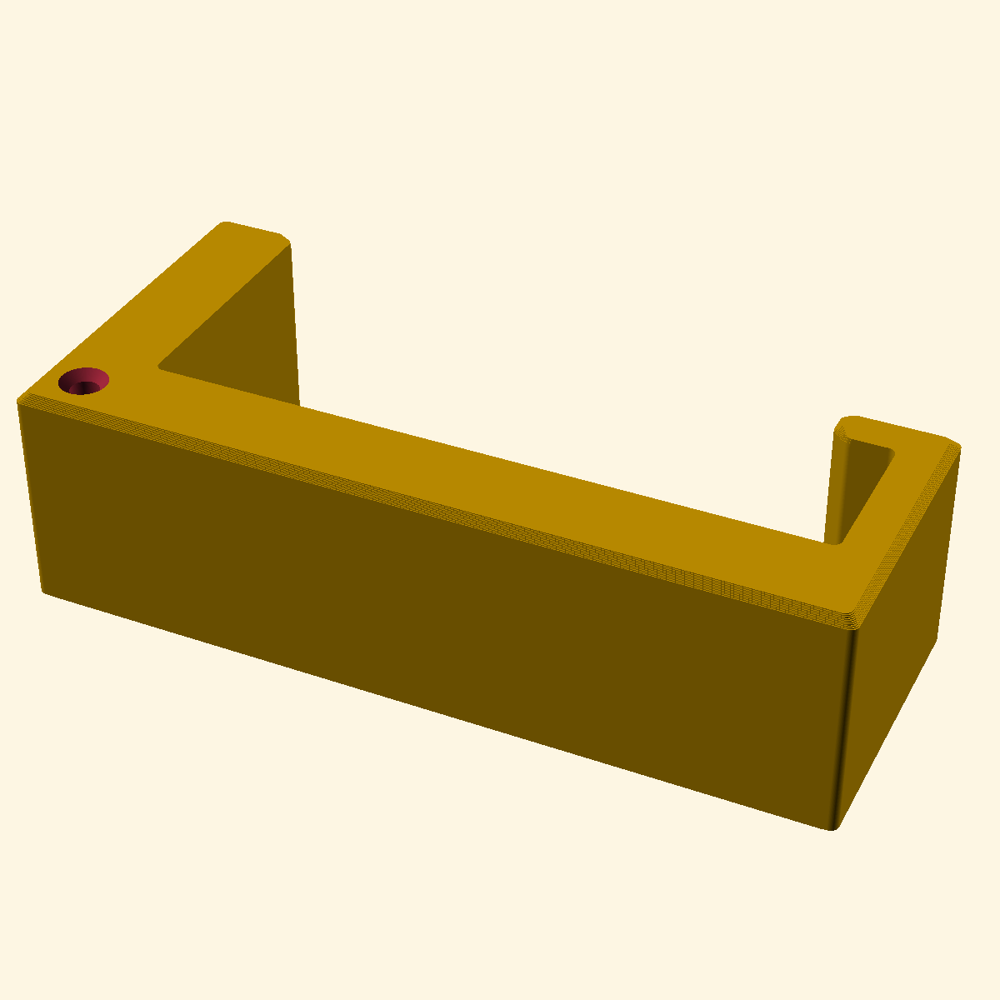
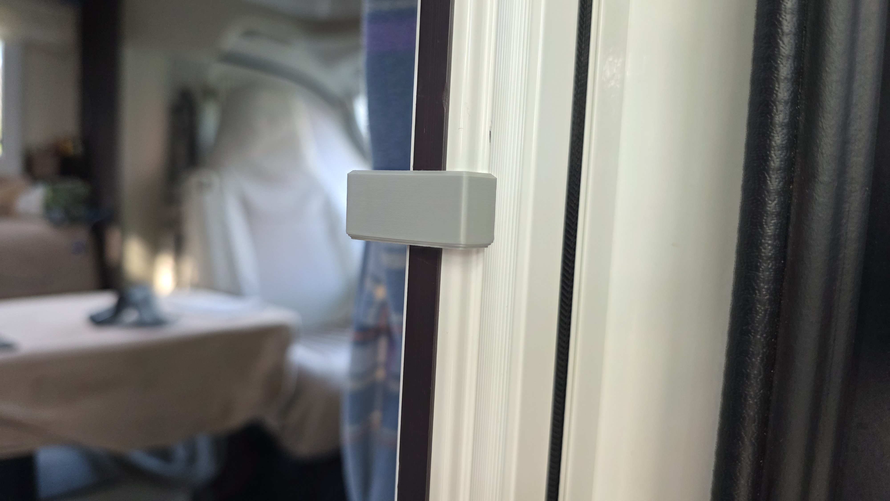
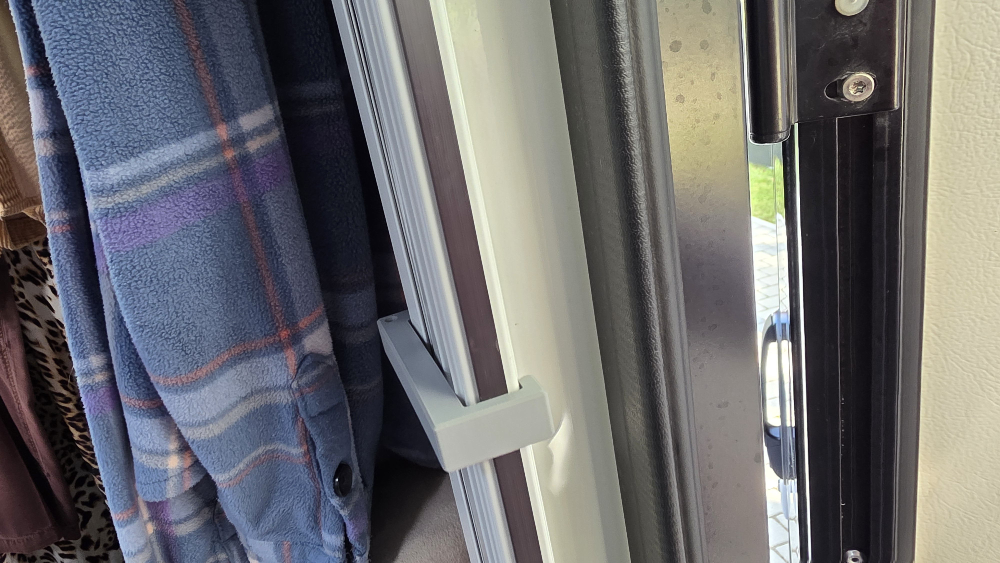

# Raddle-Master: Parametric Anti-Rattle Clamp

A fully parametric, heavy-duty clamp designed to prevent the bug-net assembly on foldable camper doors from rattling or vibrating while driving. 

## Features
- **Highly Parametric:** Built using OpenSCAD, making it extremely easy to customize dimensions using the OpenSCAD Customizer.
- **Durable Design:** Inner and outer corners are filleted to eliminate stress concentration points and prevent snapping under tension.
- **Flared Entry Ramps:** Features smooth entry bevels on both legs, allowing easy slip-on/slip-off installation without scratching the frame.
- **Integrated Tether Eyelet:** Includes an optional built-in tether hole so you can attach a lanyard or leash and avoid losing it.

---

## Visual Showcase

### Front & Side Perspectives
Below are views of the printed clamp showing its structural layout and snug fit:

| Detail View | Installed/Use View |
| :---: | :---: |
|  |  |

---

## File Structure
- `Raddle-Master.scad` — The fully parametric OpenSCAD source file.
- `Raddle-Master.stl` — The pre-rendered STL file, ready for slicing and printing.
- `Raddle-Master.png` — High-resolution model render.
- `Raddle-Master-1.jpg` & `Raddle-Master-2.jpg` — Real-world application photos.

---

## Customization Guide
Open `Raddle-Master.scad` in **OpenSCAD** and use the Customizer panel to adjust the following primary parameters:

| Parameter | Default Value | Description |
| :--- | :---: | :--- |
| `assembly_width` | `71.0` | Internal width of the bug-net frame assembly (mm). |
| `thickness` | `10.0` | Wall thickness of the L-leg and main span (mm). |
| `j_thickness` | `5.0` | Thickness of the J-leg and J-lip (mm) to avoid interference. |
| `height` | `25.0` | Height (extrusion depth in Z axis) of the clamp (mm). |
| `l_leg_length` | `30.0` | Length of the straight L-shaped leg (mm). |
| `j_leg_length` | `17.0` | Length of the J-shaped leg (mm). |
| `j_lip_length` | `7.0` | Length of the return lip on the J-shaped leg (mm). |
| `tether_hole_enabled` | `true` | Toggle the built-in tether eyelet. |

---

## 3D Printing Recommendations

To ensure maximum durability, springiness, and heat resistance (especially inside hot camper vehicles), please follow these recommended print settings:

* **Material:** **PETG**, **ABS**, or **ASA** are highly recommended. *PLA is not recommended as it will deform inside hot cars over time and lacks the necessary flexing capability.*
* **Orientation:** Print flat on its side (Z-axis height of 15mm-25mm on the print bed) to ensure layer lines run longitudinally for maximum spring arm strength.
* **Perimeters / Wall Loops:** **4 - 6 lines** (so that the flexing arms are mostly solid filament).
* **Infill:** **30% - 50% Gyroid** or Grid.
* **Supports:** No support material is required.
