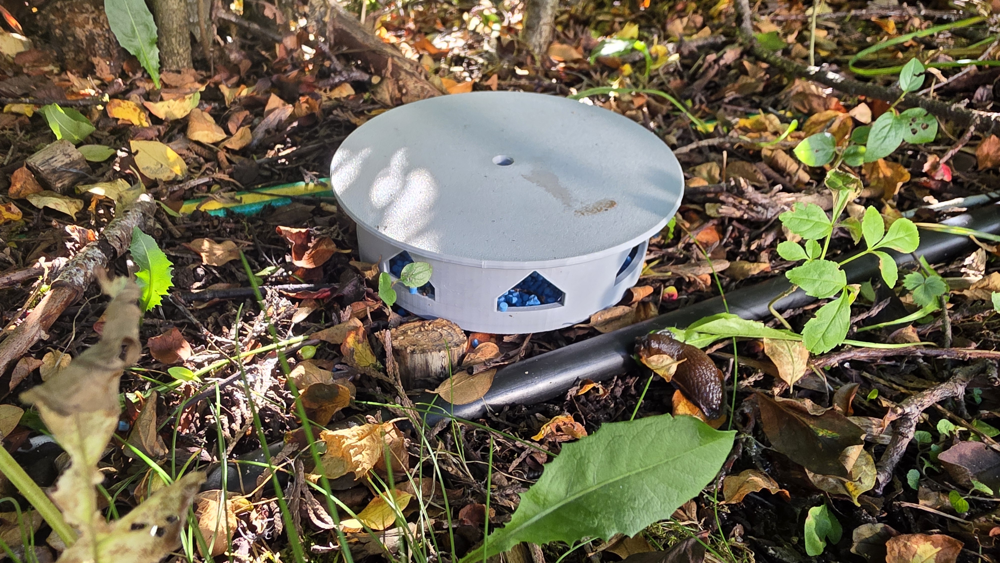
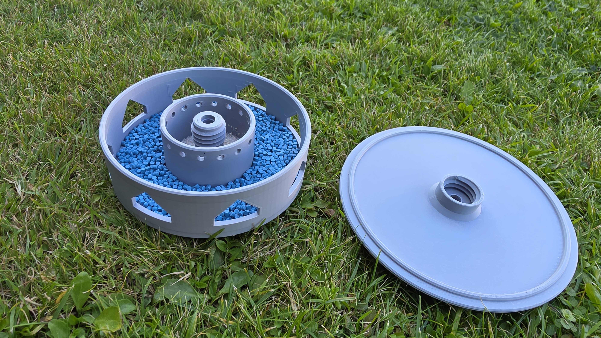
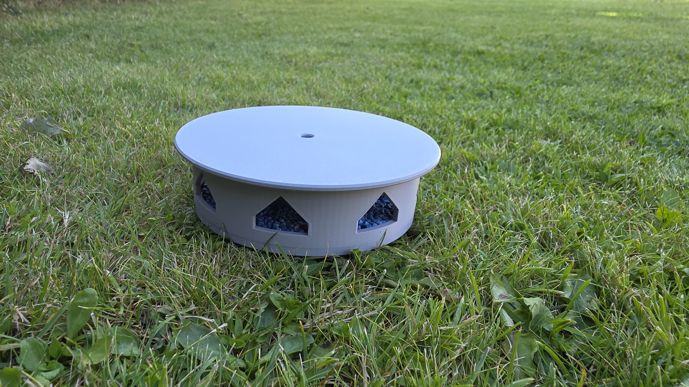

# Slug Trap

A printable, slug-free garden trap in two parts (base + lid), designed in OpenSCAD. Slugs crawl in through the low entry slots, drop onto the bait bed and into the central ferment cup, while the raised door sill keeps rain out. The lid screws on with a watertight 90° manifold thread, and a 7 mm central hole lets you stake the trap to the ground with a nail.

Video: <https://youtu.be/3ELC7s2WZh4>

## Gallery

| Render | In the garden |
| --- | --- |
|  |  |

| Base loaded with pellet bait | Assembled on the lawn |
| --- | --- |
|  |  |

## How it works

- **Base** — 120 mm outer diameter, 35 mm tall, 3 mm walls. Pentagonal entry slots (24 × 18 mm) sit on an 8 mm door sill that blocks rain; the pellet floor slopes down toward the central ferment cup (55 mm Ø) and drains through 2 mm holes.
- **Lid** — screw-on cap with a matching internal thread (3 mm pitch, 1.5 mm depth, 45°/45° symmetric tooth).
- **Grounding** — a 7 mm hole runs through the base's central tube and the lid, so a nail can be driven through to anchor the trap.

## Files

| File | Description |
| --- | --- |
| `Slug-Trap.scad` | OpenSCAD source (v3.48, 3rd major version) |
| `Slug-Trap-base.stl` / `Slug-Trap-lid.stl` | Ready-to-print STL files |
| `Slug-Trap.png` | Render of base and lid |
| `Slug-Trap-{1,2,3}.jpg` | Photos of a printed trap in use |
| `v1/`, `v2/` | Older design revisions |

## Preview in OpenSCAD

Set `view_mode` at the top of `Slug-Trap.scad`:

- `"base"` — base only
- `"lid"` — lid only
- `"both"` — base and lid side-by-side (default)
- `"assembled"` — assembled
- `"cut"` — assembled cross-section
