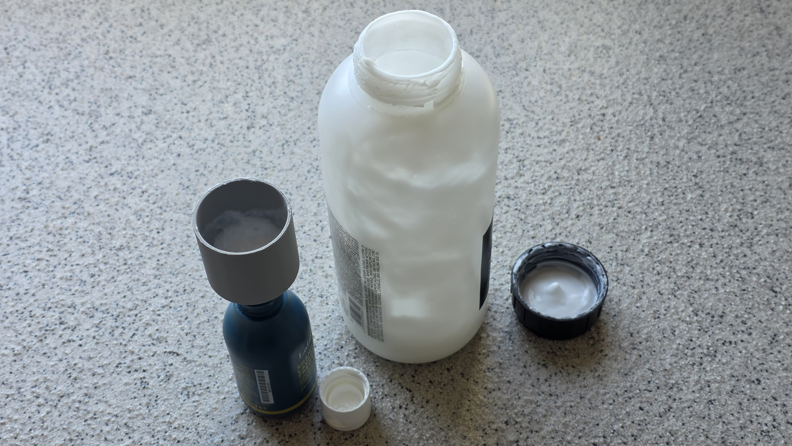

# Soap-Funnel

A parametric OpenSCAD design for a soap and conditioner refill funnel. Specifically designed for low-viscosity hair and body products, it features a 45-degree transition to allow thick liquids to slowly slide into smaller bottles without causing air blocks or spills.

## Preview

*(Place `Soap-Funnel.png` and `Soap-Funnel.jpg` in this directory to display the images above).*

## Dimensions (v0.01)
* **Wide end:** 45mm diameter, 40mm length
* **Thin end:** 18mm diameter, 20mm length
* **Transition:** 45-degree slope
* **Wall thickness:** 2.0mm
* **Edges:** Fully smoothed/rounded for safe handling and easy cleaning.

## Usage
Open `Soap-Funnel.scad` in [OpenSCAD](https://openscad.org/). You can easily tweak the variables in the file (or the Customizer) to fit your specific bottle dimensions before rendering and exporting the STL for 3D printing.

## License

This project is licensed under the MIT License - see the [LICENSE](LICENSE) file for details.
