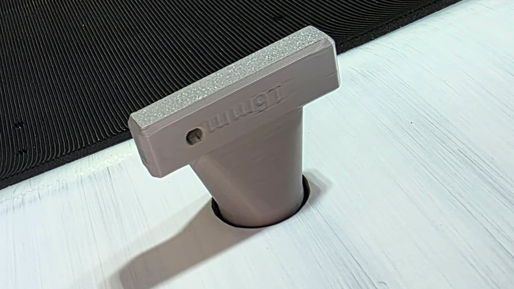
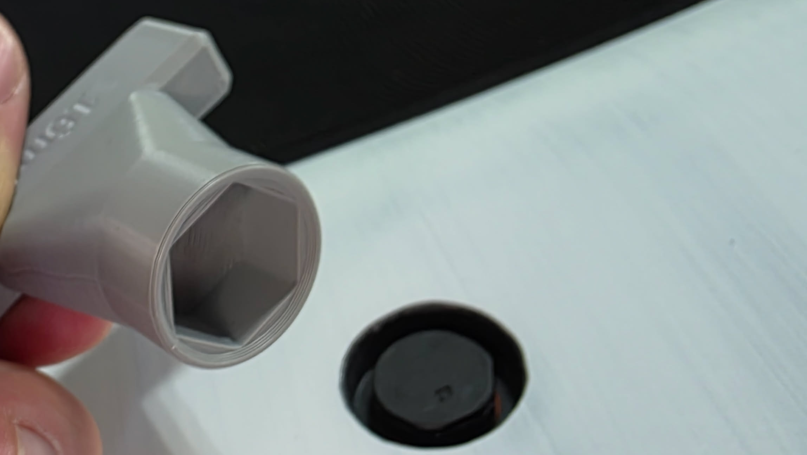

# Surfboard Airvent Socket Tool

A highly optimized, fully parametric OpenSCAD 3D-printable socket tool designed for installing and removing hex-head pressure relief vent plugs in surfboards, windsurfing boards, stand-up paddleboards (SUPs), and wing-foil boards.

---

## Gallery

### 3D Model Render

### 3D Printed Tool in Action

### Socket Engagement Detail

---

## Design Features

* **Torque Protection (50mm Handle)**: The T-handle width is strictly limited to **50mm** of leverage. This is a crucial safety feature to prevent manual over-tightening, protecting the board's plastic laminate threads and the plug's rubber O-ring seal from stripping or crushing.
* **Sleek Cavity Clearance (22mm OD)**: Designed with a **22mm** outer diameter, leaving a safe **0.5mm** clearance around the tool when inserted into the board's standard **23mm** recessed cavity.
* **Dual-Chamfer Head**:
  * **0.5mm Outer Chamfer**: Breaks the sharp outer edge of the socket cylinder, ensuring a butter-smooth entry into the board's recessed cup.
  * **0.75mm Inner Countersink**: Guides the socket effortlessly onto the 16mm hex head of the vent plug, even when sliding it in blindly.
* **100% Support-Free Printing**: Features a flat handle base with an optimized $\le 45^\circ$ transitional gusset to the shaft. It prints upright (handle-down, socket-up) with **no supports required**.
* **Ergonomic Handle Styles (Parametric)**: Using the OpenSCAD Customizer, you can choose between:
  * `"cube"`: A blocky, professional handle with 45° chamfers on all 12 edges (including bottom bed-contact edges).
  * `"rounded"`: A vertical column handle ending in smooth spherical wings.
* **Utility Features**: Includes a recessed `"16mm"` size identifier and a `4mm` keyring/lanyard hole for easy storage on the beach or on a hook.

---

## Recommended Print Settings

For maximum mechanical strength to withstand twisting forces without cracking:

* **Orientation**: Print **upright** (standing flat on the handle base; socket facing up).
* **Supports**: **None / Disabled** (not needed).
* **Material**: **PETG**, **ABS**, **ASA**, or **Tough PLA** (PETG/ABS/ASA recommended for UV and saltwater resistance).
* **Perimeters / Wall Loops**: **4 to 6 walls** (crucial for ensuring the socket walls are printed fully solid for torque resistance).
* **Infill**: **40% to 100%** (Gyroid or Grid pattern).
* **Layer Height**: **0.2mm** works perfectly.

---

## Customizer Variables

Open `Surfboard-Airvent-Socket.scad` in OpenSCAD and adjust these settings in the sidebar to match any custom board specs:

| Variable | Default | Description |
| :--- | :--- | :--- |
| `hex_size` | `16.0` | Across-flats hex width of your plug (mm) |
| `socket_depth` | `10.0` | Internal depth of the socket cup (mm) |
| `socket_outer_diameter` | `22.0` | Outer diameter of the tool cylinder (mm) |
| `clearance` | `0.2` | Fit clearance tolerance added to hex flats (mm) |
| `handle_style` | `"cube"` | Style of handle (`"cube"` or `"rounded"`) |
| `chamfer_size` | `1.5` | Size of edge phases on the cube handle (mm) |
| `handle_width` | `50.0` | Width of T-bar handle (mm) |
| `handle_thickness` | `10.0` | Thickness of the handle grip (mm) |
| `socket_chamfer_height` | `0.75` | Height of the inner lead-in countersink (mm) |
| `outer_chamfer` | `0.5` | Height of the outer rim edge break chamfer (mm) |
| `enable_lanyard_hole` | `true` | Toggles the 4mm keyring/lanyard hole |
