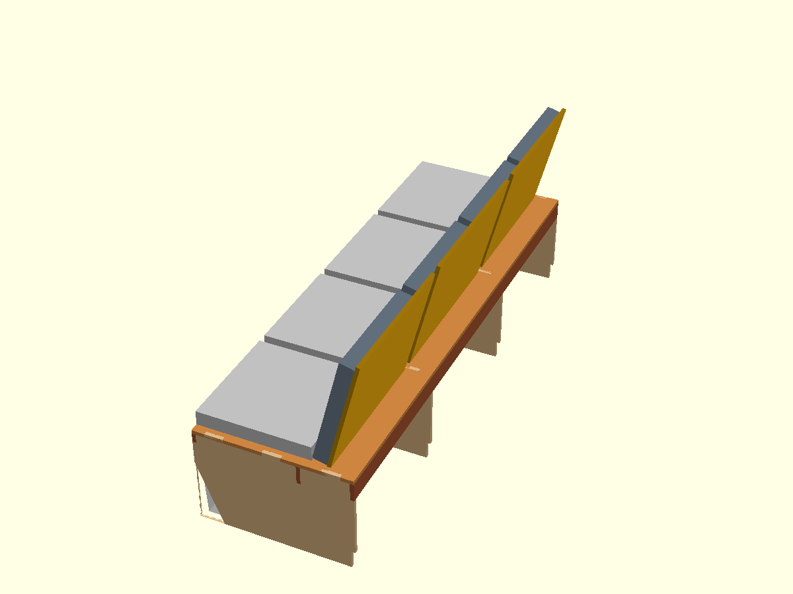
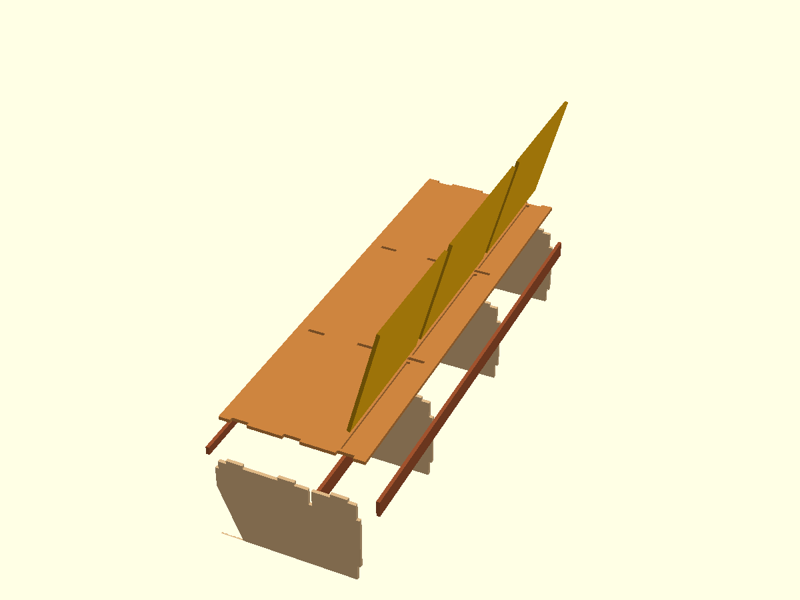
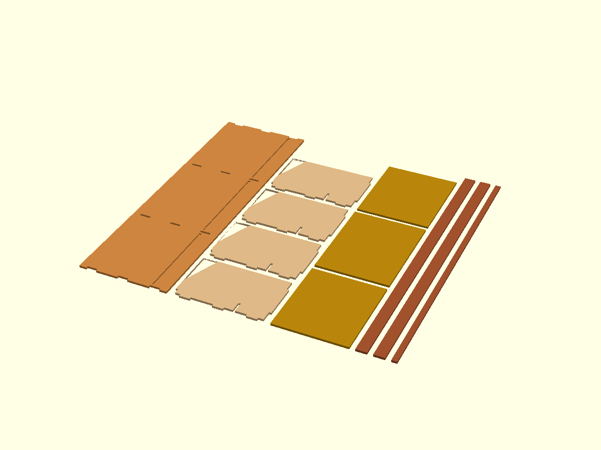
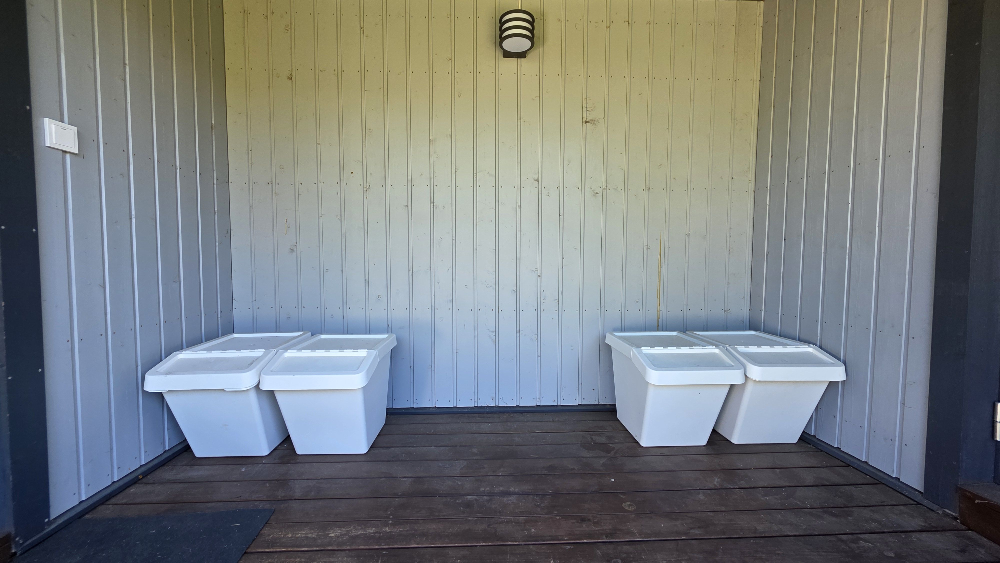
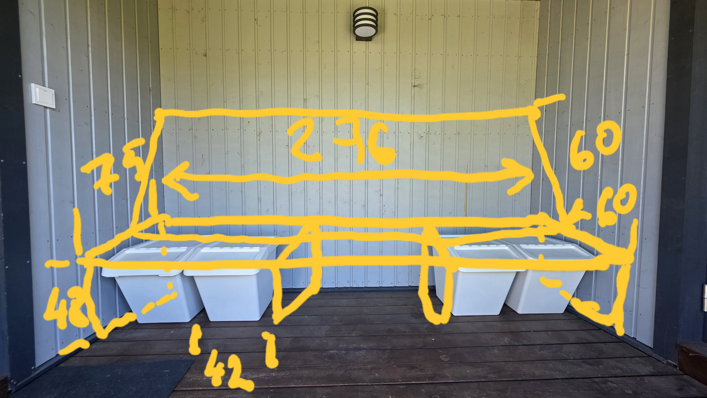

# Terrace-Bench

A fully parametric, modular, 21mm plywood terrace bench designed to span perfectly wall-to-wall in a terrace alcove. 

This smart bench is meticulously engineered with OpenSCAD to house **four 60L IKEA SORTERA** storage boxes completely flush underneath, while perfectly seating standard **62x62cm IKEA outdoor pillows** for lounging.

## Design Highlights
- **Wall-to-Wall Precision**: Fully parametric to any width (default 2760mm).
- **Self-Aligning Joinery**: Through-mortise and tenon joints in the top with robust stretcher aprons ensure zero racking and no sagging.
- **Parametric Backrest Lean**: Simply specify the backrest panel height, and the geometry calculates the exact resting angle to perfectly hit the back wall. 
- **Concealed Storage Stop**: An internal stretcher apron physically stops the IKEA Sortera boxes right as they become flush with the front of the bench.
- **Smart Plywood Profiling**: Includes $22^\circ$ toe-kick profiles perfectly mirroring the Sortera box slants, integrated skirting board notches, and thick solid-wood shoulders to prevent splintering when cutting the backrest grooves.
- **CNC Ready**: The design instantly switches between 3D assembled views and a `Z=0` 2D flat lay nesting layout for easy DXF routing path generation.

## Visualizations

### 1. Fully Assembled View
*Shows the bench in context with 62x62cm cushions (backrest pillows placed down first) and the 60L IKEA SORTERA boxes slid into the compartments under the 50mm front reinforcement apron.*

### 2. Exploded Joinery View
*Reveals the CNC-ready slotted joinery, stopped-grooves with robust 20mm shoulders, and the structural apron layout.*

### 3. Flat Lay Parts (CNC Nesting)
*All parts laid completely flat on the $Z=0$ plane, ready to export from OpenSCAD to `.DXF` or `.SVG` for CNC machining.*

## Reference Photos

*The wall-to-wall alcove where the parametric design will reside, including the IKEA Sortera boxes being dry-fitted.*

| Terrace Alcove Context | Bench Dimensions Sketch |
| :---: | :---: |
|  |  |

## Parameters Available

Open the `Terrace-Bench.scad` file in **OpenSCAD** to access the customizer. Key configurable parameters include:

- `total_width`: Wall-to-wall width (default `2720`).
- `total_depth`: Overall depth to the wall (default `860`).
- `seat_depth`: Constant sitting area depth (default `620`).
- `clearance_height`: Space underneath for boxes (default `530`).
- `backrest_panel_length`: Length of the plywood backrest cut (default `650`).
- `groove_shoulder`: Solid wood safety margins on the ends of slots (default `20`).
- `groove_slop` & `mortise_slop`: Fine-tuned CNC clearances.

---
*Generated by Zed Coding Agent - v0.06*