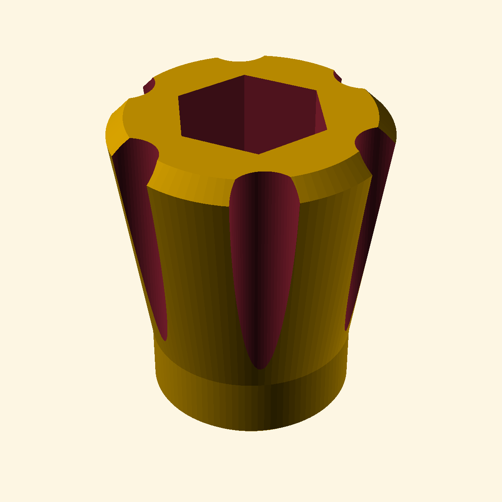

# Thumb Knob

A parametric thumb knob replacement for generic metric bolts and nuts (M4/M5/M6), designed in OpenSCAD.

## Features

- Fits standard DIN metric bolts: `M4`, `M5`, `M6` (select via `bolt_size`)
- Hex recess for the bolt head, with a threaded/shaft hole below it
- Ergonomic finger grooves around the flared body
- Fully parametric — tweak diameters, heights, grooves, and chamfers in the script

## Usage

1. Open [`Thumb-Knob.scad`](Thumb-Knob.scad) in [OpenSCAD](https://openscad.org/)
2. Adjust the parameters to your needs (see below)
3. Render and export as STL for 3D printing

### Key parameters

| Parameter | Default | Description |
| --- | --- | --- |
| `bolt_size` | `5` | Bolt size: `4` (M4), `5` (M5), `6` (M6) |
| `knob_total_height` | `18.5` | Overall knob height |
| `knob_neck_height` | `4.0` | Straight neck (shaft) height |
| `num_grooves` | `6` | Number of finger grooves |
| `wall_thickness` | `1.5` | Wall thickness around the hex recess |

## License

MIT
